# Beyond Black-Scholes: Fitting Lévy Processes to Stock Returns

*Master writeup, Weeks 1 to 5 combined. Compiled from the committed markdown sources; regenerate with `build_master.py`.*

---

# Week 1: Literature Review

*Applied Statistical Research in Financial Market Risk Modelling*
*Beyond Black-Scholes: Fitting Lévy Processes to Stock Returns*

## 1. Introduction

Since the early 1970s, quantitative finance has run on one big assumption: daily stock returns are normally distributed. Black-Scholes is built on it. Most of classical financial econometrics depends on it. The problem is that it is wrong in ways that matter. Real returns have fatter tails and sharper peaks than any Gaussian, and they skew negative, crashes hit harder and more often than the equivalent rally.

This review makes the case for replacing the Gaussian baseline with Lévy processes, specifically the Variance-Gamma (VG) process (Madan, Carr and Chang, 1998). It also covers the empirical evidence motivating the switch (Cont, 2001) and the backtesting framework used to assess whether a better distributional fit actually improves risk estimates in practice (Christoffersen, 1998).

## 2. Empirical Failures of the Gaussian Model

### 2.1 Stylised Facts of Financial Returns

Cont (2001) is the standard reference for what financial return data actually looks like. He surveys equities, foreign exchange, and commodities and finds the same statistical patterns recurring across all of them. The paper is worth reading carefully, not because the individual facts are surprising, but because Cont is rigorous about which properties are truly universal and which are asset-class specific.

The facts most relevant to this project are:

- **Excess kurtosis.** Daily log-returns have far more mass in the tails and centre than a Gaussian. Cont (2001) reports excess kurtosis of around 15.95 for S&P 500 futures at the five-minute scale, with higher figures for foreign exchange. Extreme moves happen much more often than the normal distribution predicts.
- **Gain/loss asymmetry.** Large falls in equity prices are more common than equivalently large rises. Cont (2001) notes this is specific to equities; foreign exchange markets show no such directional asymmetry. That is worth keeping in mind when interpreting skewness estimates.
- **Heavy tails.** Using extreme value theory, Cont (2001) puts the tail index between two and five for most markets studied. This rules out the normal distribution and also rules out stable laws with infinite variance. The distribution has finite variance, but the tails are heavy enough that kurtosis is large.
- **Volatility clustering.** Raw returns show no autocorrelation, but squared and absolute returns do, and the autocorrelation decays slowly. This is the main mechanism by which VaR violations cluster in practice. This is what Christoffersen (1998) builds his independence test to detect.
- **Aggregational Gaussianity.** At longer horizons, returns look increasingly normal. The non-Gaussian behaviour is a daily phenomenon, which is why this project focuses on daily data.

One of Cont's more useful observations is structural: to fit all of the above properties, a parametric model needs at least four parameters, location, scale, tail decay, and asymmetry. That rules out the Gaussian (two parameters) and the Student-t (three parameters). The four-parameter Lévy models are the natural next step.

### 2.2 Evidence from Major Stress Episodes

The S&P 500 dataset covers the dot-com crash (2000–2002), the Global Financial Crisis (2007–2009), the COVID shock (March 2020), and the Fed rate-hike cycle (2022–2023). In March 2020 alone, several daily moves exceeded five historical standard deviations. Under a Gaussian model, each one of those is essentially impossible. Under a well-fitted Lévy model, they are unlikely but not negligible, and that difference is exactly what this project is trying to quantify.

## 3. Lévy Processes: Theoretical Framework

### 3.1 Definition and the Lévy–Khintchine Theorem

A Lévy process has three properties: independent increments, stationary increments, and càdlàg sample paths. Brownian motion is the simplest example, but the class is much broader. The Lévy–Khintchine theorem gives the full picture. Any Lévy process is characterised by a drift b, a Gaussian variance σ², and a Lévy measure ν on ℝ\{0}. The Lévy measure is where the interesting behaviour lives: it controls jump intensity and magnitude. Set ν to zero and you get Brownian motion with drift. Make it non-trivial and the process jumps, with frequency and size governed by ν. That is the financial point: jumps capture sudden large moves that continuous diffusion cannot produce by construction.

### 3.2 Subordination: Building Lévy Models from Brownian Motion

Madan, Carr and Chang (1998) construct the VG process by subordination: Brownian motion is evaluated not at calendar time but at a random time change T(t) that is itself a non-decreasing Lévy process. The result inherits independent and stationary increments from both components. Intuitively, the clock runs fast during volatile periods and slow during quiet ones. Madan, Carr and Chang (1998) tie this directly to economics: each unit of calendar time has a random effective length drawn from a gamma distribution, capturing variation in market activity. More practically, subordination yields closed-form density functions that can be fitted by maximum likelihood without simulation.

## 4. The Variance-Gamma Model

### 4.1 Construction and Parameters

The VG process was introduced by Madan and Seneta (1990) and given its definitive form in Madan, Carr and Chang (1998), "The Variance Gamma Process and Option Pricing." The construction subordinates Brownian motion with drift to a Gamma process. Let W(t) be standard Brownian motion, θ a drift, σ a volatility, and γ(t; 1, ν) a Gamma process with unit mean rate and variance rate ν. The VG process is:

X(t; σ, ν, θ) = θγ(t; 1, ν) + σW(γ(t; 1, ν))

The model has three parameters beyond the mean return. σ is volatility. θ drives skewness: negative θ gives the left skew seen in equities. ν controls tail heaviness. This satisfies Cont's structural requirement exactly.

The parameter interpretations are precise. Madan, Carr and Chang (1998) derive the central moments explicitly. The third central moment is proportional to (2θ³ν² + 3σ²θν)t, so θ = 0 implies zero skewness and the sign of θ determines the direction of skew. When θ = 0, ν is directly the annualised percentage excess kurtosis: ν is quoted per unit of annual time, so at the daily horizon the kurtosis is 3(1 + 365ν). All moments are finite, which means VaR and Expected Shortfall are well-defined under the model.

Unlike Brownian motion, the VG process has no continuous martingale component: it is a pure jump process of finite variation. It can be written as the difference of two independent increasing gamma processes, one for upward moves and one for downward. The relative sizes of those two processes determine the skew. The VG process also inherits from the gamma process an infinite arrival rate of small jumps, which is what makes it behave like Brownian motion at fine scales while still allowing occasional large discontinuities. Madan, Carr and Chang (1998) argue this makes the VG more realistic than Poisson jump-diffusion models, which require a finite jump rate and therefore need a separate diffusion component.

### 4.2 Estimation and Empirical Results

Madan, Carr and Chang (1998) estimated the VG model on S&P 500 data from January 1992 to September 1994 by maximum likelihood. The density involves a modified Bessel function of the second kind, available in standard numerical libraries, so MLE is a straightforward L-BFGS-B optimisation. The results are useful for setting expectations.

On the statistical process, the lognormal model is strongly rejected against the symmetric VG with a χ²(1) statistic of 83.94. The skewness parameter θ is statistically insignificant, the S&P 500 daily return distribution is approximately symmetric. Excess kurtosis is the real story: the estimated ν = 0.002 (in annual units) corresponds to a daily kurtosis of 3(1 + 0.002 × 365) ≈ 5.19, against 3 for the Gaussian. Adding the full asymmetric VG on top of the symmetric one makes no improvement for the statistical process.

The risk-neutral estimation is different. Inverting the VG option pricing formula across 143 weeks of S&P 500 futures options gives an average θ = −0.14, strong negative skew, and much higher kurtosis than in the statistical process. Both are consistent with risk aversion: investors pay a premium for protection against large negative jumps. The sign and magnitude of the risk-neutral skew is a direct function of risk aversion in the equilibrium framework.

The option pricing results also matter. On orthogonality tests of pricing errors, the full VG achieves an adjusted R² of 0.001, against 0.161 for Black-Scholes and 0.171 for the symmetric VG. VG pricing errors are essentially unpredictable from moneyness or maturity. The Black-Scholes model is rejected in favour of the VG in 91.6% of the 143 weeks at the 1% level.

## 5. Risk Estimation and VaR Backtesting

### 5.1 Value at Risk and Expected Shortfall

VaR at confidence level α is the loss not exceeded on (1 − α) of trading days. Expected Shortfall is the expected loss on days that do exceed VaR. ES has replaced VaR as the primary regulatory metric under Basel III/IV at 97.5% confidence. For the Gaussian, both are in closed form. For the VG, they require numerical integration over the fitted density, which is tractable given the closed-form density derived in Madan, Carr and Chang (1998). The question this project will answer concretely: by how many basis points does the Gaussian underestimate 99th-percentile daily loss relative to the VG?

### 5.2 Christoffersen's Conditional Coverage Framework

Christoffersen (1998), "Evaluating Interval Forecasts," built the standard framework for testing whether a VaR model is actually well-calibrated. The paper's starting point is a criticism of existing practice: most of the literature tests only whether violations occur at the right average rate, and ignores whether those violations cluster in time. A model can pass the average-rate test while systematically underestimating risk during volatile periods. That is precisely when accurate risk estimates matter most.

The paper introduces three likelihood ratio tests. The unconditional coverage test (LR_uc) asks whether E[I_t] = p, where I_t indicates a violation on day t. This is asymptotically χ²(1). The independence test (LR_ind) models the violation sequence as a first-order Markov chain and tests whether a violation today is more likely given a violation yesterday. Also χ²(1). The conditional coverage test (LR_cc = LR_uc + LR_ind) combines both, distributed χ²(2). A model that gets the average rate right but clusters its failures passes the UC test and fails the independence test.

The empirical application in Christoffersen (1998) uses daily exchange rate data and compares three forecasts: static empirical quantiles, the J.P. Morgan RiskMetrics IGARCH model, and a GARCH(1,1) with Student-t innovations. Static forecasts consistently pass the UC test and fail the independence test because they cannot adapt to volatility clustering. The GARCH-t model passes the independence test across most coverage rates. The lesson is not that Gaussian models fail on average, but that they fail when it matters, in runs during stress periods.

In this project, a rolling estimation window computes one-day-ahead 99% VaR under each model at each step across the 2000–2024 sample. The UC and CC tests are then applied to the violation sequences. Given that the dataset includes four distinct crisis sub-periods, the independence test should be particularly informative: a model with a Gaussian-shaped tail will produce violation clusters that are hard to miss.

## 6. Synthesis

These three papers give this project its structure. Cont (2001) establishes what the data looks like and sets a concrete requirement: four-parameter distributions with separate control over location, scale, tail decay, and asymmetry. Madan, Carr and Chang (1998) show that the VG process meets those requirements, derive the density formulas needed for MLE, and validate the model on S&P 500 data, finding that the statistical process is approximately symmetric but that excess kurtosis is highly significant, with daily kurtosis around 5.19. The Black-Scholes model is rejected in over 90% of weeks in their option pricing tests. Christoffersen (1998) shows how to test whether a better distributional fit actually translates into better risk estimates, and why the independence of violations matters as much as the average violation rate.

What this project adds is a side-by-side comparison of the Gaussian and Student-t baselines against the VG model on a single 25-year dataset from 2000 to 2024, one that contains an unusually dense collection of stress events. The sub-period breakdowns and rolling backtest together give a fuller picture of where each model holds and where it breaks than any of the original papers attempt.

## Bibliography

Christoffersen, P. F. (1998). Evaluating Interval Forecasts. *International Economic Review*, 39(4), 841–862.

Cont, R. (2001). Empirical Properties of Asset Returns: Stylised Facts and Statistical Issues. *Quantitative Finance*, 1(2), 223–236.

Madan, D. B., Carr, P. P. and Chang, E. C. (1998). The Variance Gamma Process and Option Pricing. *European Finance Review*, 2(1), 79–105.

---

# Week 2 results: Gaussian and Student-t MLE

## 1. Overview

This week I fitted two distributions to 6,287 daily log-returns on the S&P 500 (January 2000 to December 2024): the Gaussian as the standard baseline, and the Student-t as an upgrade that allows for heavier tails. The goal was to find out whether the Gaussian is actually adequate for daily returns, and to put a number on how wrong its risk estimates are if it isn't.

---

## 2. The data

Figure 1 shows the full return series. I chose a 25-year window to cover four distinct market stress periods: the dot-com crash (2000–2002), the Global Financial Crisis (2007–2009), the COVID-19 shock (February–June 2020), and the Fed rate hike cycle (2022–2023). These are shaded in the figure.

The volatility is uneven. The 2012–2019 period looks almost flat against the GFC and COVID spikes. The single worst day in the sample, roughly −12% on 16 March 2020, barely looks like it belongs to the same series as a typical day in 2017.

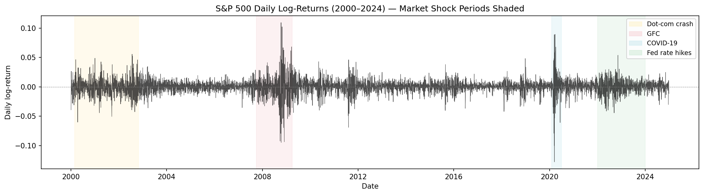

*Figure 1. S&P 500 daily log-returns (2000–2024) with the four market shock periods shaded.*

---

## 3. Parameter estimates

I fitted both models by Maximum Likelihood Estimation (MLE). Tables 1 and 2 report the results.

**Table 1. Gaussian MLE results.**

| Parameter | Estimate | Standard Error | t-statistic |
|-----------|----------|----------------|-------------|
| μ (daily drift) | +0.000223 | 0.000154 | 1.45 |
| σ (scale) | 0.012234 | 0.000109 | — |
| Log-likelihood | 18,764.3 | — | — |
| AIC | −37,524.5 | — | — |
| BIC | −37,511.0 | — | — |

The Gaussian results are unsurprising. The daily drift of +0.022% is indistinguishable from zero (t-statistic 1.45), which is what you'd expect in an efficient market. Annualised volatility comes out at 19.4%, in line with long-run S&P 500 figures.

**Table 2. Student-t MLE results.**

| Parameter | Estimate | Standard Error | 95% CI |
|-----------|----------|----------------|--------|
| ν (degrees of freedom) | 2.648 | 0.110 | (2.43, 2.87) |
| μ (location) | +0.000656 | 0.000110 | — |
| σ (scale) | 0.007077 | 0.000128 | — |
| Log-likelihood | 19,666.7 | — | — |
| AIC | −39,327.5 | — | — |
| BIC | −39,307.2 | — | — |

The key result is ν̂ = 2.648. The confidence interval stays above 2 at the lower end, so the variance is technically finite. But 2.648 is below 3, which means skewness is formally undefined, and well below 4, which means kurtosis is formally undefined too. The data is consistent with a distribution of infinite kurtosis.

Worth noting: the Student-t σ of 0.0071 is not the standard deviation. The actual standard deviation is σ × √(ν / (ν − 2)), which works out to about 1.43% per day, higher than the Gaussian's 1.22%. The Student-t packs its spread into the tails rather than the centre.

---

## 4. Model fit

Figure 2 overlays both fitted PDFs on a histogram of the actual returns. The Gaussian is too flat at the centre and too spread across the moderate loss range. The Student-t fits the sharp central peak much better, and its tails sit higher at the extremes.

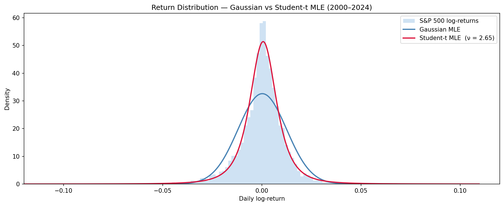

*Figure 2. Return histogram with Gaussian MLE (blue) and Student-t MLE (red) PDFs overlaid.*

The QQ plots make the difference clearest. A QQ plot sorts the data and compares each value to what the theoretical distribution predicts at that rank. Points on the diagonal mean a perfect fit.

Figure 3 shows the Gaussian QQ. The S-shape is the signature of fat tails: the actual worst daily loss plots at around −10 standardised units, while the Gaussian predicts roughly −3.5 at that rank. The worst day was more than three times as extreme as the model allows.

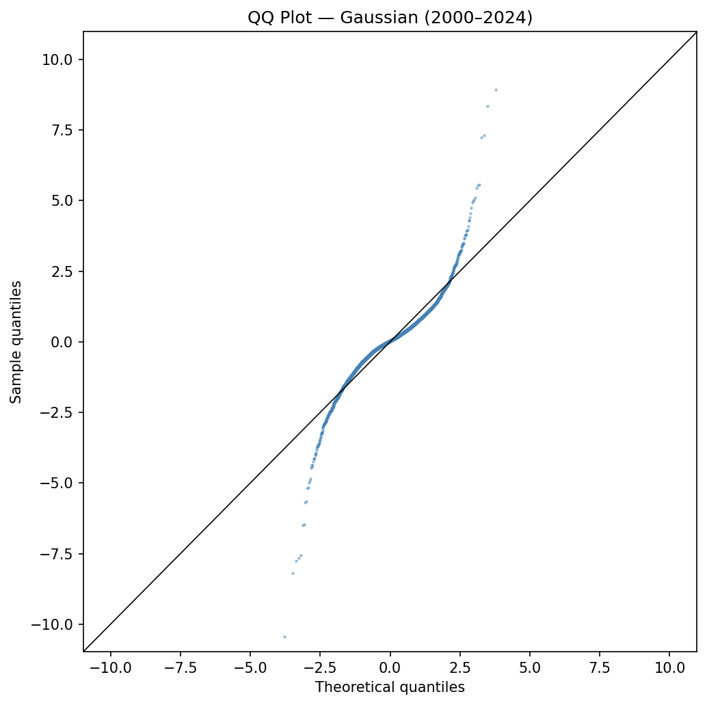

*Figure 3. QQ plot against N(0,1). The S-shape confirms fat tails in both directions.*

Figure 4 shows the Student-t QQ. The fit is dramatically better across the central 99% of the data. The remaining departures are a handful of extreme observations at each end: 9/11, the Lehman collapse, the March 2020 crash. These look more like structural breaks than draws from a stable distribution.

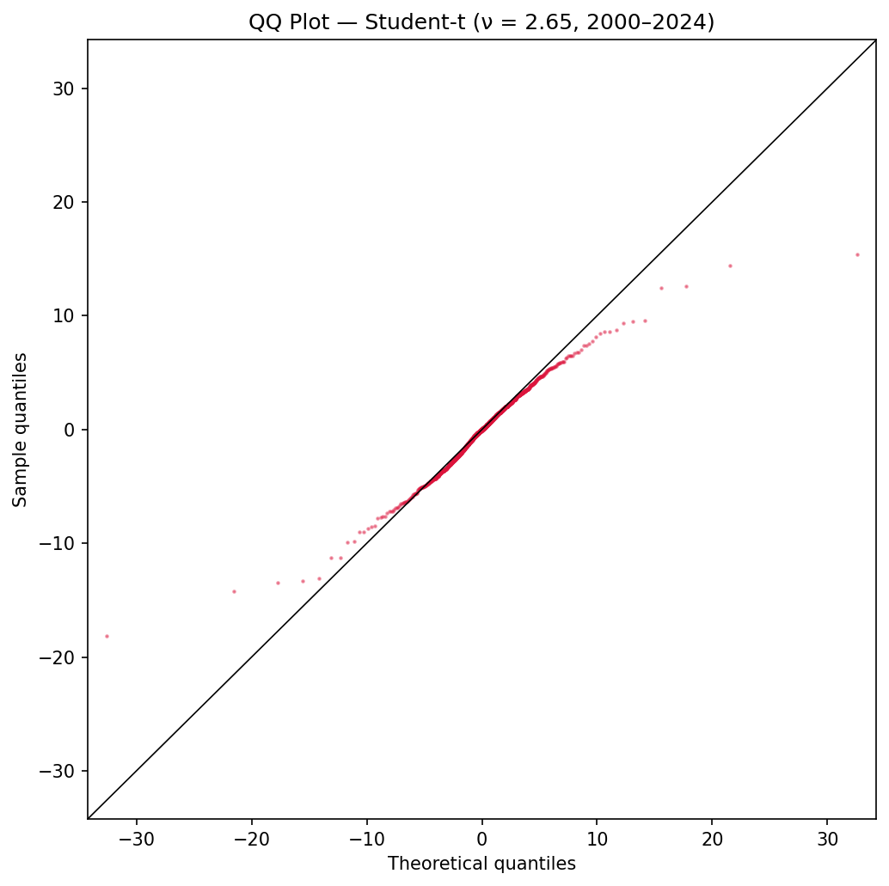

*Figure 4. QQ plot against t(ν = 2.648). Near-perfect fit across the central 99%; residual departures correspond to major crisis events.*

**Table 3. Kolmogorov-Smirnov goodness-of-fit on standardised residuals.**

| Model | KS statistic (D) | p-value\* | n |
|-------|-----------------|----------|---|
| Gaussian | 0.094 | <0.001 | 6,287 |
| Student-t | 0.018 | 0.030 | 6,287 |

The KS statistic D backs up the QQ plots. The Student-t D of 0.018 is five times smaller than the Gaussian's 0.094. Both technically reject at n = 6,287, but the gap between them is what matters.

**Table 4. Model comparison by AIC and BIC. Lower is better.**

| Model | Parameters | Log-likelihood | AIC | BIC |
|-------|------------|---------------|-----|-----|
| Gaussian | 2 | 18,764.3 | −37,524.5 | −37,511.0 |
| Student-t | 3 | 19,666.7 | −39,327.5 | −39,307.2 |

The AIC difference is 1,803 units. AIC already penalises the Student-t for its extra parameter, so this isn't just a reward for complexity. Adding ν is worth 1,803 units of genuine fit improvement.

---

## 5. Risk measures

VaR tells you the loss threshold exceeded on the worst α% of days. ES tells you the average loss on those days.

**Table 5. Daily VaR and ES. Negative values = losses.**

| Confidence | VaR (Gaussian) | ES (Gaussian) | VaR (Student-t) | ES (Student-t) |
|------------|---------------|--------------|----------------|---------------|
| 95% | −1.990% | −2.501% | −1.694% | −3.000% |
| 99% | −2.824% | −3.238% | −3.515% | −5.813% |

At 95%, the Gaussian VaR looks more conservative than the Student-t (−1.99% vs −1.69%). That's because the Student-t's fitted σ is much smaller (0.71% vs 1.22%), which at moderate quantile depths outweighs the heavier-tail effect. But even at 95%, ES tells the opposite story: Student-t ES of −3.00% is 20% worse than the Gaussian's −2.50%. Once inside the tail, the heavier distribution wins.

At 99%, there is no crossover. Student-t ES is −5.81% against the Gaussian's −3.24%. A portfolio using Gaussian ES to set capital would hold roughly 44% too little (3.238 / 5.813 = 0.557). That's the number this whole week was building toward.

---

## 6. How crises change the distribution

When you fit each model separately to the four shock windows, the variation in tail behaviour is interesting.

**Table 6. Sub-period MLE results. ν̂ is fitted independently to each window.**

| Period | n | Gaussian σ (ann.) | Student-t ν̂ | Student-t σ (ann.) |
|--------|---|------------------|------------|-------------------|
| Full sample (2000–2024) | 6,287 | 19.4% | 2.648 | 11.2% |
| Dot-com crash | 671 | 23.5% | 6.526 | 19.7% |
| GFC | 378 | 38.3% | 2.607 | 23.0% |
| COVID-19 | 104 | 50.5% | 2.285 | 28.4% |
| Fed rate hikes | 501 | 19.5% | 6.525 | 16.3% |

The ν̂ values are where it gets interesting. The GFC and COVID periods return ν̂ around 2.3–2.6, extremely close to the boundary where variance becomes infinite. The dot-com crash and rate hike cycle return ν̂ around 6.5, close enough to the Gaussian that the difference barely matters. Evidence suggests crises are structurally different.

A counterintuitive feature of the crisis windows is that excess kurtosis falls even as variance rises sharply. In a sustained crisis, extreme daily moves are no longer outliers relative to the elevated variance, nearly every day is volatile, so the distribution spreads broadly rather than concentrating mass near the centre with a thin spike. The excess kurtosis that drives ν̂ down in the full sample comes largely from the contrast between tranquil and turbulent regimes; within a crisis window that contrast disappears, and the within-period distribution is wide but not especially peaked.

Figure 5 shows the annual return distributions for 2000–2024, with crisis years highlighted and annualised volatility labelled in each panel. 2008 (σ = 41%) and 2020 (σ = 35%) stand out clearly. The 2013–2019 stretch looks narrow by comparison, with σ as low as 7% in 2017. The dot-com years are elevated but noticeably more moderate than the GFC, which matches the higher ν̂.

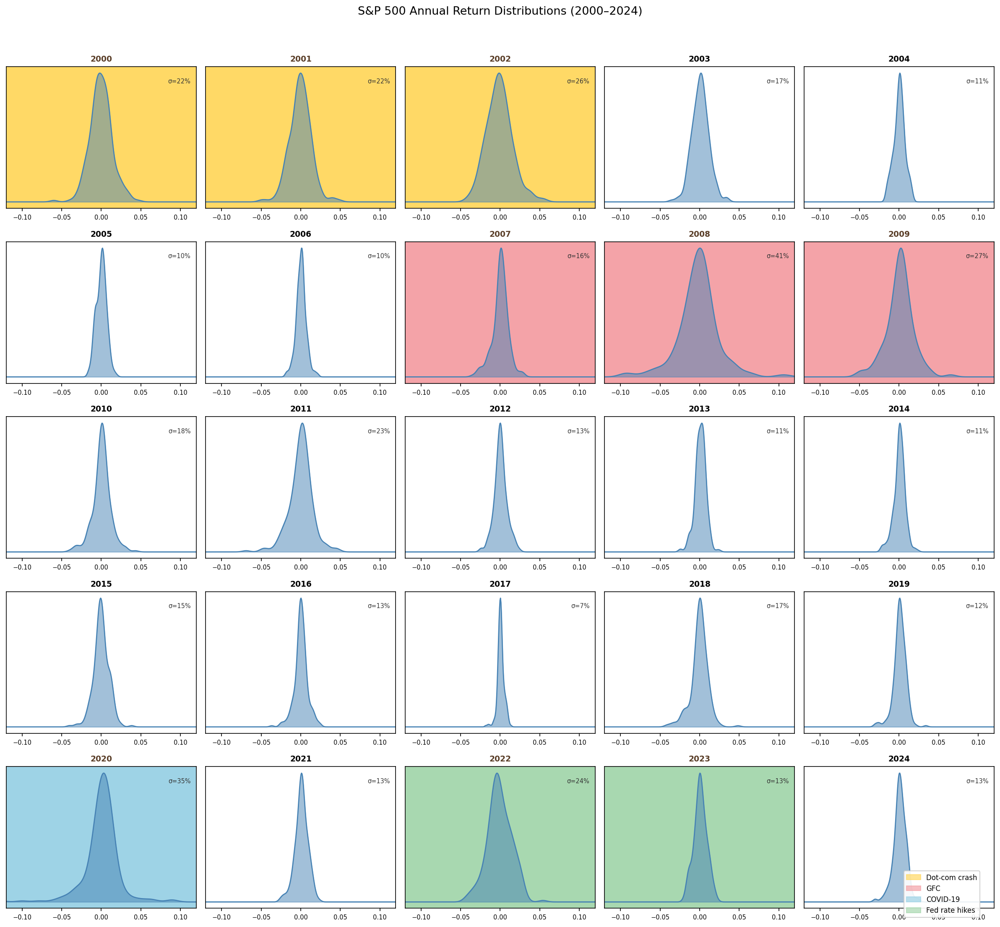

*Figure 5. Annual return distributions, 2000–2024. Crisis years are highlighted; annualised volatility is shown in each panel.*

The full-sample ν̂ of 2.648 is effectively an average across all these regimes. In calm years it overstates tail risk; in GFC conditions it may still understate it.

---

## 7. Five-year block marginals

Figures 6–10 break the 25-year sample into five 5-year blocks, each showing five annual panels side by side. The legend adds two entries relative to Figure 5: an x = 0 reference line (grey dashed) marking zero return, and the year mean (black dotted). Shock-window background shading follows the same colour scheme as Figure 1. The inset annotation in each panel gives annualised σ and ν.

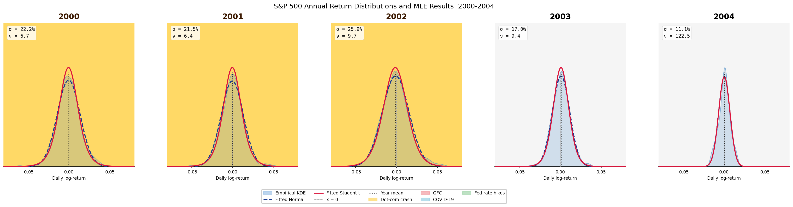

*Figure 6. Annual return distributions, 2000–2004. Dot-com crash years (2000–2002) are shaded.*

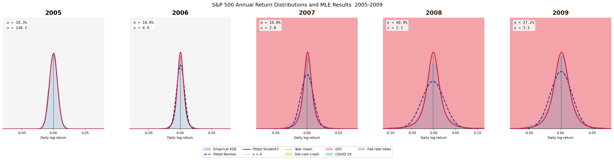

*Figure 7. Annual return distributions, 2005–2009. GFC (2007–2009) panels are shaded; ν drops to 2.6 in 2008.*

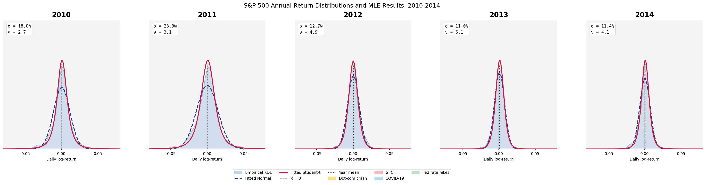

*Figure 8. Annual return distributions, 2010–2014. Post-crisis recovery; annualised volatility declines across the block.*

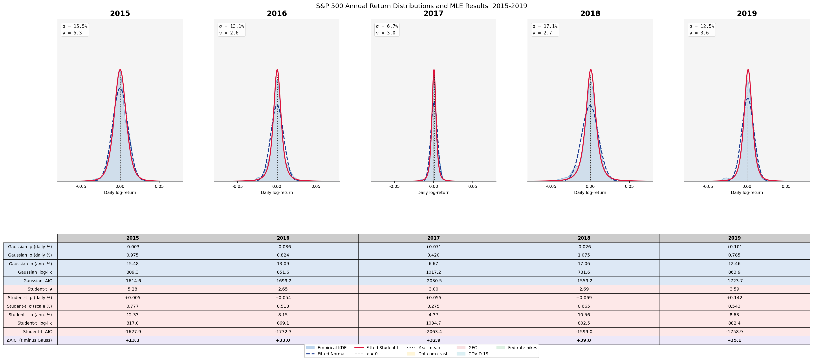

*Figure 9. Annual return distributions, 2015–2019. 2017 shows the narrowest spread in the full sample (σ = 7%).*

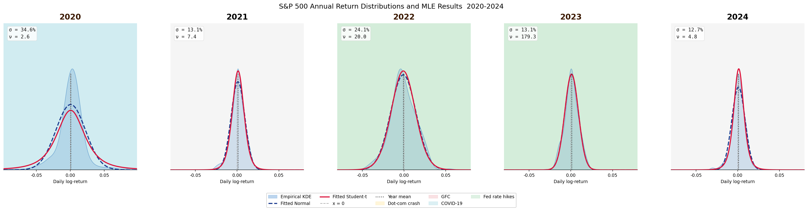

*Figure 10. Annual return distributions, 2020–2024. The 2020 COVID panel produces σ = 35% and ν near 2.3.*

---

# Week 3 results: Laplace, Variance-Gamma and NIG MLE

## 1. Overview

This week I extended the comparison to five distributional models on the same 6,287 daily S&P 500 log-returns used in Week 2: Laplace (double-exponential), Variance-Gamma (VG), and Normal Inverse Gaussian (NIG) alongside the Gaussian and Student-t. The Laplace is a two-parameter benchmark (the symmetric VG special case, θ = 0, ν = 1) and with the same parameter count as the Gaussian it captures 96% of the AIC gain the four-parameter NIG achieves. Most of the improvement over the Gaussian comes from exponential rather than thin tails. NIG is the best-fitting model and the only one not rejected by KS; its 99% ES of −5.19% sits between the Gaussian (−3.24%) and the Student-t (−5.81%). The sub-period analysis shows the GFC and COVID were structurally different crises from the dot-com crash and the rate-hike cycle.

---

## 2. Parameter estimates

**Table 1. Gaussian MLE (Week 2).**

| Parameter | Estimate | Standard Error | t-statistic |
|-----------|----------|----------------|-------------|
| μ (daily drift) | +0.000223 | 0.000154 | 1.45 |
| σ (scale) | 0.012234 | 0.000109 |  |
| Log-likelihood | 18,764.3 |  |  |
| AIC | −37,524.5 |  |  |
| BIC | −37,511.0 |  |  |

**Table 2. Laplace MLE (symmetric VG special case: θ = 0, ν = 1).**

| Parameter | Estimate | Standard Error |
|-----------|----------|----------------|
| μ (location) | +0.000602 | 0.000102 |
| b (scale) | 0.008078 | 0.000102 |
| Log-likelihood | 19,649.9 |  |
| AIC | −39,295.7 |  |
| BIC | −39,282.2 |  |

Its log-likelihood beats the Gaussian by 885.6 and falls only 15.6 short of the full VG despite fixing θ = 0 and ν = 1; the exponential-tail gain alone dwarfs the benefit of freeing those two parameters.

**Table 3. Student-t MLE (Week 2).**

| Parameter | Estimate | Standard Error | 95% CI |
|-----------|----------|----------------|--------|
| ν (degrees of freedom) | 2.648 | 0.110 | (2.43, 2.87) |
| μ (location) | +0.000656 | 0.000110 |  |
| σ (scale) | 0.007077 | 0.000128 |  |
| Log-likelihood | 19,666.7 |  |  |
| AIC | −39,327.5 |  |  |
| BIC | −39,307.2 |  |  |

**Table 4. Variance-Gamma MLE.**

| Parameter | Estimate | Standard Error |
|-----------|----------|----------------|
| σ (scale) | 0.011629 | 0.000163 |
| θ (asymmetry) | −0.000660 | 0.000149 |
| ν (variance rate) | 1.17431 | 0.043159 |
| μ (location) | +0.000883 | 0.000023 |
| Log-likelihood | 19,665.5 |  |
| AIC | −39,322.9 |  |
| BIC | −39,296.0 |  |

VG's log-likelihood nearly matches the Student-t's despite two extra parameters, giving slightly worse AIC. Negative θ confirms left skew; ν = 1.174 confirms the Gamma time-change is active.

**Table 5. Normal Inverse Gaussian MLE.**

| Parameter | Estimate | Standard Error |
|-----------|----------|----------------|
| α (tail-heaviness) | 52.341 | 2.786 |
| β (asymmetry) | −6.095 | 1.498 |
| δ (scale) | 0.007574 | 0.000217 |
| μ (location) | +0.001111 | 0.000150 |
| Log-likelihood | 19,691.7 |  |
| AIC | −39,375.3 |  |
| BIC | −39,348.4 |  |

NIG achieves the highest log-likelihood and an AIC improvement of 1,851 units over the Gaussian. Negative β confirms left skew; α falls to 17–26 in the GFC and COVID (Section 5): far heavier tails than the full-sample 52.

---

## 3. Model fit

Figure 1 overlays all five PDFs on the return histogram; the four non-Gaussian curves look similar to the eye, with Laplace and Student-t nearly indistinguishable at this scale. Figure 2's QQ plots show the difference more precisely: NIG and VG sit closest to the diagonal throughout, while the Laplace's tails are slightly too light at the most extreme points.

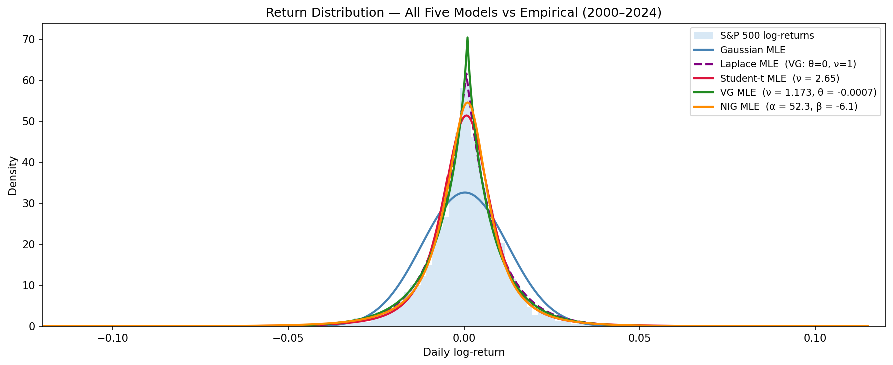

*Figure 1. Return histogram with all five fitted PDFs. Gaussian (blue), Laplace (purple, dashed), Student-t (red), VG (green), NIG (orange).*

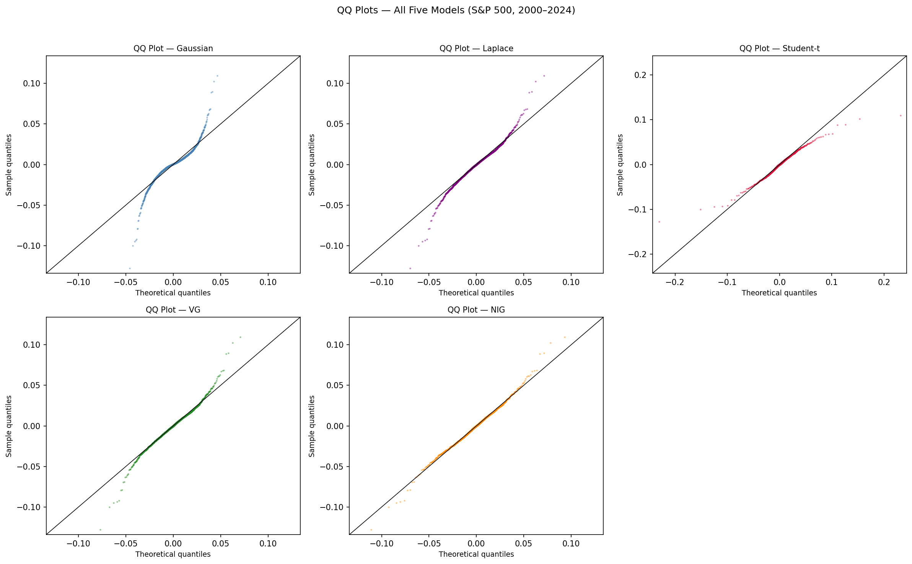

*Figure 2. QQ plots for all five models. The Gaussian S-shape (top left) is severe. NIG (bottom row) sits closest to the diagonal.*

**Table 6. Kolmogorov-Smirnov goodness-of-fit.**

| Model | KS statistic (D) | p-value | n |
|-------|-----------------|---------|---|
| Gaussian | 0.0938 | <0.001 | 6,287 |
| Laplace | 0.0180 | 0.034 | 6,287 |
| Student-t | 0.0182 | 0.030 | 6,287 |
| VG | 0.0129 | 0.250 | 6,287 |
| NIG | 0.0113 | 0.399 | 6,287 |

NIG is the only model not rejected by KS; VG passes too. Laplace and Student-t tie on D (0.0180 vs 0.0182) and are borderline. KS for VG and NIG uses the two-sample test against 1,000,000 simulated draws.

**Table 7. Model comparison. Lower AIC/BIC is better.**

| Model | Parameters | Log-lik | AIC | BIC | ΔAIC vs Gaussian |
|-------|------------|---------|-----|-----|------------------|
| Gaussian | 2 | 18,764.3 | −37,524.5 | −37,511.0 |  |
| Laplace | 2 | 19,649.9 | −39,295.7 | −39,282.2 | −1,771.2 |
| Student-t | 3 | 19,666.7 | −39,327.5 | −39,307.2 | −1,802.9 |
| VG | 4 | 19,665.5 | −39,322.9 | −39,296.0 | −1,798.4 |
| NIG | 4 | 19,691.7 | −39,375.3 | −39,348.4 | −1,850.8 |

The Laplace reaches ΔAIC −1,771 with two parameters (96% of NIG's gain), confirming exponential tails account for most of the improvement over the Gaussian. VG is slightly worse than the three-parameter Student-t on both AIC and BIC; NIG gains 26 log-likelihood units over VG, meaning the Inverse Gaussian mixing distribution captures something the Gamma cannot.

---

## 4. Risk measures

**Table 8. Daily VaR and ES for all five models. Negative values = losses.**

| Confidence | VaR (Gauss.) | ES (Gauss.) | VaR (Lap) | ES (Lap) | VaR (t) | ES (t) | VaR (VG) | ES (VG) | VaR (NIG) | ES (NIG) |
|------------|-------------|------------|-----------|----------|---------|--------|----------|---------|-----------|----------|
| 95% | −1.990% | −2.501% | −1.800% | −2.608% | −1.694% | −3.000% | −1.915% | −2.820% | −1.880% | −3.075% |
| 97.5% | −2.376% | −2.838% | −2.360% | −3.168% | −2.366% | −4.020% | −2.542% | −3.447% | −2.646% | −3.941% |
| 99% | −2.824% | −3.238% | −3.100% | −3.908% | −3.515% | −5.813% | −3.363% | −4.283% | −3.769% | −5.187% |

At 99% ES the five models span from −3.24% (Gaussian) to −5.81% (Student-t). The Laplace at −3.91% already exceeds the Gaussian by 21% from exponential tails alone. The Student-t's outlier reading reflects its symmetric constraint at ν = 2.648, which inflates the right tail to match the left. VG and NIG, with asymmetry parameters, sit at −4.28% and −5.19%. Using the Gaussian ES to set capital leaves a 37% shortfall against NIG. Under FRTB (BCBS 2013), that shortfall is material.

The 97.5% row is the one FRTB mandates: the Basel III/IV internal-models framework sets regulatory capital from ES at 97.5% confidence. At that level the Gaussian ES of −2.84% sits 28% below the NIG's −3.94% and 29% below the Student-t's −4.02%. The Gaussian shortfall is already material at the confidence level the regulation uses, well before the deep 99% tail.

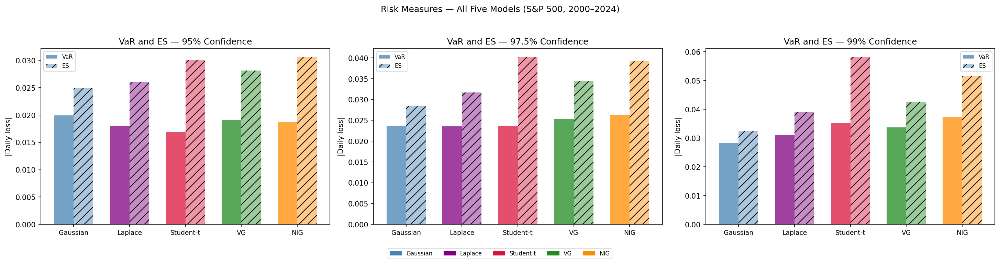

*Figure 3. VaR and ES at 95%, 97.5% (the FRTB ES confidence level) and 99% for all five models. Hatched bars are ES.*

---

## 5. How crises change the distribution

**Table 9. Sub-period parameter estimates. Each window fitted independently.**

| Period | n | Gauss. σ (ann.) | t ν | VG ν | VG θ | NIG α | NIG β |
|--------|---|-----------------|-----|------|------|-------|-------|
| Full sample | 6,287 | 19.4% | 2.648 | 1.174 | −0.00066 | 52.3 | −6.09 |
| Dot-com crash | 671 | 23.5% | 6.526 | 0.397 | +0.00190 | 98.6 | +10.04 |
| GFC | 378 | 38.3% | 2.607 | 1.250 | −0.00297 | 25.9 | −2.74 |
| COVID-19 | 104 | 50.5% | 2.285 | 1.910 | −0.00495 | 17.8 | −4.17 |
| Fed rate hikes | 501 | 19.5% | 6.525 | 0.493 | −0.00002 | 111.9 | −3.85 |

The GFC and COVID return Student-t ν around 2.3–2.6, near the variance singularity at ν = 2, and NIG α falls to 17–26. The dot-com crash and rate-hike cycle show ν around 6.5 and NIG α near 99–112, near-Gaussian. The two crisis types differ in kind: the dot-com was a slow drawdown; the GFC and COVID were clusters of extreme single-day moves, invisible in volatility alone but clear in the tail parameters.

**Table 10. AIC improvement over Gaussian by period. Positive = Lévy model preferred.**

| Period | ΔAIC (Student-t) | ΔAIC (VG) | ΔAIC (NIG) |
|--------|------------------|-----------|------------|
| Full sample | 1,802.9 | 1,798.4 | 1,850.8 |
| Dot-com crash | 22.7 | 22.3 | 23.0 |
| GFC | 72.7 | 78.7 | 76.4 |
| COVID-19 | 19.7 | 23.1 | 20.9 |
| Fed rate hikes | 16.0 | 16.2 | 15.1 |

The GFC improvement is 72–79 units; calm periods are 15–23. Lévy models earn their keep exactly when markets are worst.

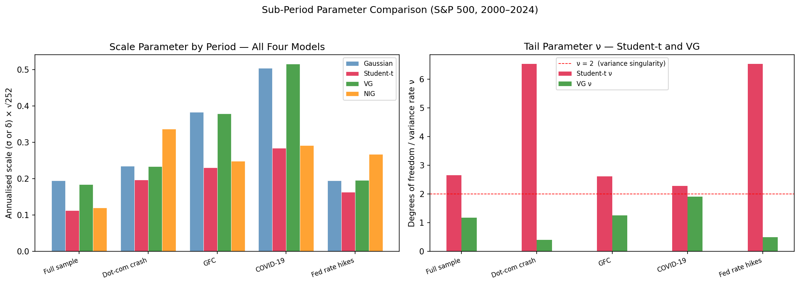

*Figure 4. Left: annualised scale by period and model. Right: tail parameter ν for Student-t and VG. The dashed line is the ν = 2 variance singularity.*

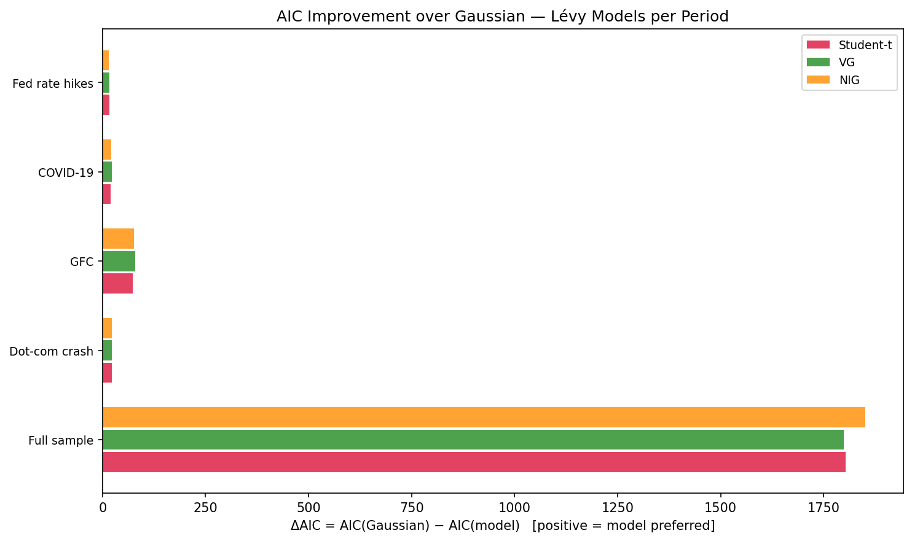

*Figure 5. AIC improvement of each Lévy model over the Gaussian by period.*

---

# Week 3: Regression analyses

This write-up reports two regressions from Week 3. The first (Sections 1–3) models forward 21-day realised volatility on seven factors observable at day t, using daily S&P 500 data from 2000 to 2024 (n = 6,207), and examines which factors were elevated before the four shock windows. The target is the dispersion of returns over the coming month, not their direction. The second (Section 4) regresses the fitted VG and NIG parameters on the annual VIX.

---

## 1. The model

The dependent variable is forward realised volatility over the next 21 trading days, annualised. Every predictor is built from information available only up to day t. Rolling skewness and rolling excess kurtosis are short-window empirical analogues of the VG and NIG shape parameters, asking whether recent tail shape carries information about forward risk beyond recent volatility.

**Table 1. The seven lead-up predictors. All are trailing quantities measured at day t.**

| Predictor | Definition |
|-----------|------------|
| Trailing 21d vol | Annualised standard deviation of returns over the last 21 days |
| VIX level | CBOE Volatility Index level (options-implied 30-day vol) |
| ΔVIX (5d) | 5-day change in the VIX |
| \|return\| (1d) | Absolute value of the most recent daily return |
| Rolling skew (21d) | Sample skewness of returns over the last 21 days |
| Rolling kurtosis (21d) | Excess kurtosis of returns over the last 21 days (tail proxy) |
| Drawdown (252d) | Current price relative to its trailing 252-day peak (≤ 0) |

The model is OLS on the full daily sample. Consecutive forward windows overlap (day t and t+1 share 20 of 21 days), so residuals are strongly autocorrelated; all standard errors are Newey-West HAC (Bartlett kernel, bandwidth 21). Coefficients are reported in standardised form: a coefficient of 0.40 means a one-standard-deviation rise in a factor goes with a 0.40-standard-deviation rise in forward volatility.

Before running any regression it is worth showing why the VIX belongs in it. Figure 1 plots the VIX against trailing 21-day realised volatility, both annualised, for every day in the sample. The two track each other closely, with Pearson r = 0.88 and Spearman ρ = 0.84 (n = 6,207). Options-implied and recently realised volatility are largely the same quantity measured two ways, which is why the VIX carries real information about dispersion and is the natural lead predictor. The fitted slope is close to one, and most points sit a little below the 45-degree line, the usual variance risk premium: implied volatility tends to run slightly above the volatility that is later realised.

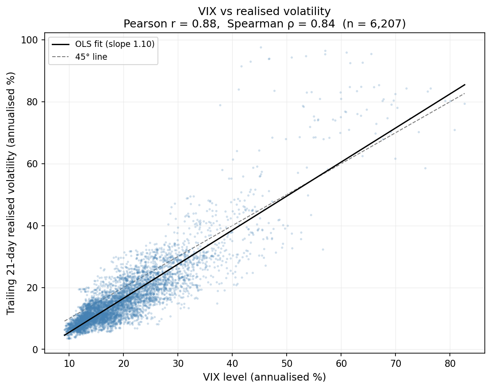

*Figure 1. The VIX against trailing 21-day realised volatility, both annualised percent, one point per trading day (n = 6,207). Pearson r = 0.88, Spearman ρ = 0.84. The strong positive association is the empirical justification for using the VIX as the lead predictor of forward volatility.*

---

## 2. Results

A volatility-only baseline explains forward volatility with R² = 0.441, as expected from volatility clustering. Adding the six remaining factors raises R² to 0.553, an increment of 0.112 from the implied-volatility, tail and drawdown factors.

**Table 2. Variance in forward 21-day realised volatility explained. n = 6,207.**

| Model | Predictors | R² | Adjusted R² |
|-------|-----------|----|-------------|
| Baseline | Trailing 21d vol only | 0.441 | 0.441 |
| Full | All seven lead-up factors | 0.553 | 0.552 |
| Increment | Tail / VIX / drawdown factors | +0.112 |  |

VIX level is the strongest factor (+0.40, t = 4.2): options-implied volatility is the market's own forward-looking dispersion estimate. ΔVIX (+0.12, t = 2.4) and absolute return (+0.05, t = 2.2) are also positive and significant. Drawdown carries a negative coefficient (−0.11, t = −1.8). The variable is at most zero and equals zero at the trailing peak, so the negative sign means the deeper the market sits below its peak, the higher forward volatility tends to be. This is the familiar leverage effect. Holding the other factors fixed, a market at its peak predicts lower forward volatility, which sits oddly beside the Section 3 finding that all four shocks began near a peak. There is no contradiction: Section 3 describes where those particular episodes started, while the coefficient is the average relationship across all 6,207 days. Rolling excess kurtosis is also negative (−0.04, t = −2.1); once volatility and VIX are controlled for, a kurtosis spike marks a jump that has already happened rather than risk still building. Rolling skewness is indistinguishable from zero.

**Table 3. Standardised coefficients of the full model, Newey-West HAC standard errors (bandwidth 21). The intercept is zero by construction and is omitted.**

| Factor | Std. coefficient | HAC SE | t-stat | p-value |
|--------|------------------|--------|--------|---------|
| VIX level | +0.399 | 0.094 | +4.23 | <0.001 |
| Trailing 21d vol | +0.203 | 0.105 | +1.94 | 0.053 |
| ΔVIX (5d) | +0.122 | 0.050 | +2.44 | 0.015 |
| \|return\| (1d) | +0.052 | 0.023 | +2.24 | 0.025 |
| Rolling skew (21d) | −0.025 | 0.026 | −0.97 | 0.333 |
| Rolling kurtosis (21d) | −0.040 | 0.019 | −2.09 | 0.037 |
| Drawdown (252d) | −0.115 | 0.063 | −1.82 | 0.069 |

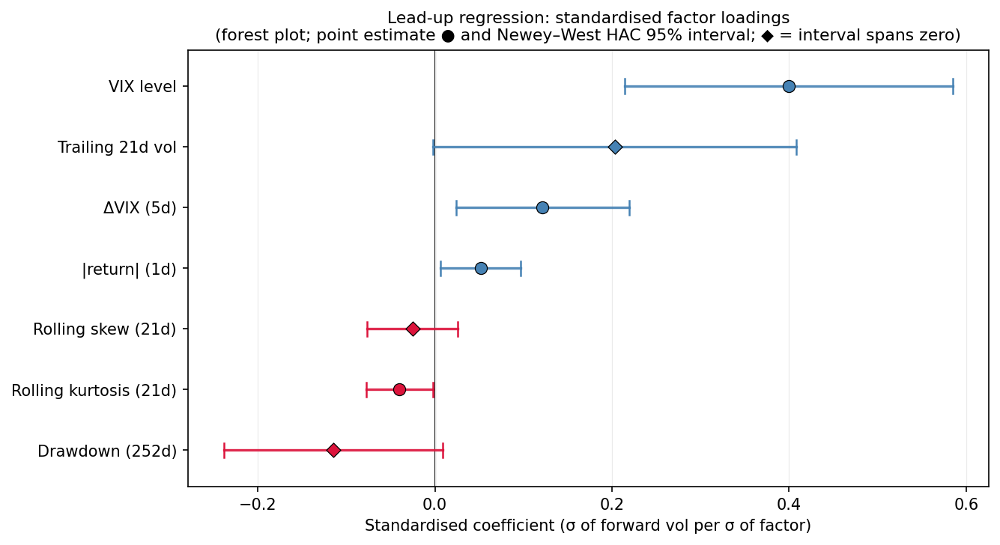

*Figure 2. Forest plot of the standardised factor loadings: each point is a coefficient estimate and the whisker its Newey-West HAC 95% interval, with factors ordered by effect size and a filled circle marking intervals that exclude zero (diamonds mark those that span it). The VIX level dominates; drawdown and rolling kurtosis carry negative loadings.*

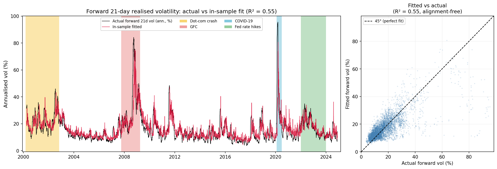

*Figure 3. Left: actual forward 21-day realised volatility (black) against the in-sample fitted values (red), with the four shock windows shaded. Right: the same fit as fitted-against-actual, which removes the time axis altogether; points cluster on the 45-degree line, falling below it at the highest volatilities where the model under-predicts. In-sample R² = 0.55.*

The two curves sit on top of each other across the calm bulk of the sample but separate at the sharpest spikes. This is structural: 

- The actual (black) is forward-looking. The forward realised volatility for day t 
- The fitted (red) is built from trailing and contemporaneous factors, trailing 21-day volatility, the VIX level, the absolute return, all measured at t. 
- So at a jump the black leaps immediately and the red only catches up about a horizon later, once trailing volatility and the VIX have risen. 

The right panel makes the same point without a time axis: agreement is tight in the dense low-to-mid-volatility cloud and the largest actual volatilities sit below the 45-degree line, the days the model under-predicts.

---

## 3. What was elevated before each shock

Table 4 reports the average standardised level of each factor over the 21 trading days immediately before each shock window. Because factors are z-scored over the full sample, +0.7 means the factor stood 0.7 standard deviations above its full-sample mean going into the episode.

Drawdown is positive before all four episodes (+0.17, +0.34, +0.68, +0.64): each shock began from a market near its trailing peak. The dot-com and GFC run-ups carried mildly elevated volatility and VIX (+0.58/+0.45 and +0.39/+0.30). COVID-19 was the opposite: volatility, VIX and skewness were all well below average in the weeks before the crash (−0.80, −0.70, −0.57), because that shock erupted from an unusually calm market.

**Table 4. Mean standardised factor level in the 21 trading days before each shock window (z-scores).**

| Shock window | Trail vol | VIX | ΔVIX | \|ret\| | Skew | Kurt | Drawdn |
|--------------|-----------|-----|------|---------|------|------|--------|
| Dot-com crash | +0.58 | +0.45 | +0.03 | +0.23 | −0.61 | −0.15 | +0.17 |
| GFC | +0.39 | +0.30 | −0.36 | −0.09 | +0.04 | −0.25 | +0.34 |
| COVID-19 | −0.80 | −0.70 | +0.25 | −0.26 | −0.57 | −0.47 | +0.68 |
| Fed rate hikes | +0.14 | +0.12 | −0.59 | +0.13 | −0.14 | −0.64 | +0.64 |

The dot-com crash starts in March 2000, inside the 252-day drawdown warm-up of the 2000–2024 sample, so its lead-up window is otherwise undefined. To report all four shocks consistently, the dot-com row alone is computed on a panel extended with pre-2000 price history solely to warm the trailing-peak drawdown; every factor is still standardised against the 2000–2024 sample, so the other three rows are unchanged. This extension is used only for this table and is not carried into the rest of the project.

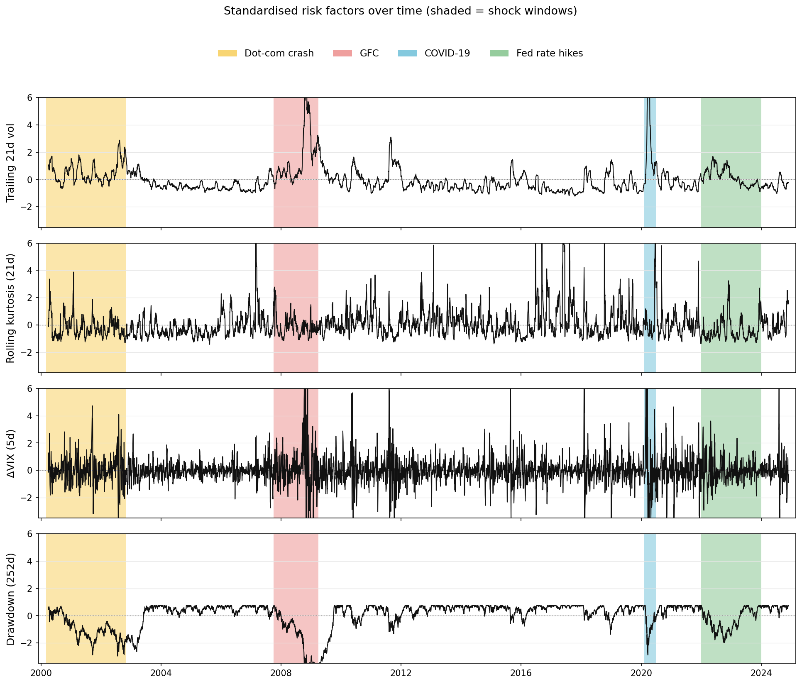

*Figure 4. Standardised trajectories of four representative factors (trailing volatility, rolling kurtosis, the 5-day VIX change, and drawdown), with the four shock windows shaded.*

---

## 4. Fitted Lévy parameters versus the VIX

Each calendar year from 2000 to 2024 is fitted separately, giving 25 annual estimates of each VG and NIG parameter, each then regressed on that year's average VIX (n = 25).

**Table 5. The fitted parameters and how each relates to the VIX.**

| Parameter | What it controls | Relationship with the VIX |
|-----------|------------------|---------------------------|
| VG σ (scale) | Width of the diffusion component | Strong and positive (R² = 0.90, p < 0.001): scale rises almost one-for-one with the VIX |
| VG θ (asymmetry) | Skew; negative means a heavier left tail | None detectable (R² = 0.01, p = 0.60) |
| VG ν (variance rate) | Tail heaviness from the random time-change | None detectable (R² = 0.06, p = 0.24) |
| NIG α (tail heaviness) | Larger means lighter tails | Weak and negative (R² = 0.12, p = 0.09): tails tend to get heavier as the VIX rises |
| NIG β (asymmetry) | Skew; negative means a heavier left tail | None detectable (R² = 0.08, p = 0.16) |
| NIG δ (scale) | Overall spread | None detectable (R² = 0.00, p = 0.95) |

The VIX tracks distribution scale very closely (VG σ, R² = 0.90) but carries almost no information about tail shape or asymmetry. Every tail and skew parameter is statistically flat against the VIX; only NIG α shows a marginal signal. Knowing the VIX tells you how wide the distribution will be, but little about how heavy or lopsided its tails are. That distinction matters for ES-based capital, since ES is driven by tail shape rather than scale.

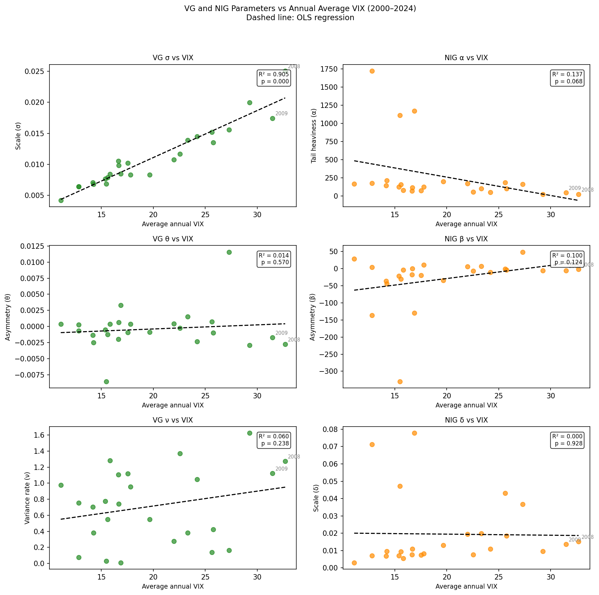

*Figure 5. Annual VG and NIG parameter estimates (2000 to 2024) against that year's average VIX, with OLS regression lines; each panel shows its R² and p-value. Only VG σ (top left) has a strong relationship with the VIX; the tail and asymmetry parameters are essentially flat.*

---

## 5. Limitations

These results are in-sample. The predictors in the lead-up regression are correlated (most obviously trailing volatility and VIX), so coefficients are partial associations rather than independent effects. Overlapping forward windows make the effective sample smaller than n = 6,207; Newey-West SEs correct for this but not for the correlation between predictors. The 21-day horizon is a modelling choice: a shorter or longer window shifts the relative weight of fast factors (VIX change, absolute return) and slow ones (drawdown).

Two further caveats apply to the Section 4 regressions. The dependent variables are themselves estimates: each annual fit uses only around 250 observations, so the tail parameters in particular are noisy, and that noise inflates the residual variance and weakens any relationship the regression could find. The flat tail-parameter results are therefore partly a power problem. And with six parameters each tested against the VIX at n = 25, one marginal p-value (NIG α, p = 0.09) is about what chance alone would produce, so I read it as suggestive at most.

---

# Week 4: Bayesian estimation with NUTS

## 1. Bayesian Refitting

Weeks 2 and 3 fitted every model by maximum likelihood. That gives one best value for each parameter and a standard error read off the curvature of the likelihood. 

For this week I refitted four models in a Bayesian setting and drew their full posteriors with the No-U-Turn Sampler (NUTS) in PyMC. My goal here is to know whether the posterior for ν stays on the finite-variance side of 2 or whether it leaks below.

The four models are the Gaussian, the Laplace, the Student-t and the NIG. The Laplace stands in for the Variance-Gamma family here. It is the symmetric VG with θ = 0 and ν = 1, and unlike the full VG it has a closed-form density, so it carries the heavy-tail idea without dragging in any special functions. The NIG keeps its full four-parameter density.

---

## 2. Choosing the priors

A Bayesian fit needs a prior on each parameter, I made my selections based on their level of informativeness. That is, weakly informative priors. This is due to the loose 6,287 daily returns, but tight enough to rule out values that are not sensible. I started each prior from Week 3 MLE and then widened it well beyond the plausible range.

**Table 1. Priors and the reasoning behind each.**

| Parameter | Prior | Reasoning |
|-----------|-------|-----------|
| μ (all models) | Normal(0, 0.001) | Daily drift is tiny and barely identified; centred at zero, wide enough to cover any realistic value |
| σ, b, δ (scales) | HalfNormal(0.02) | Must be positive; 0.02 is generous next to a daily volatility near one percent |
| ν (Student-t) | Gamma(2, 0.1) | Mean 20, with a long right tail. It leans toward light tails, so any pull down toward ν ≈ 2.6 has to come from the data |
| γ (NIG) | Gamma(4, 4/52) | Mean 52, standard deviation 26; sets the tail decay and fixes α through α = √(γ² + β²) |
| β (NIG) | Normal(0, 15) | Asymmetry, free to take either sign |

The ν prior is the one I thought about most. It would have been easy to put a prior that only allows ν > 2 and guarantees a finite variance. I deliberately did not make that the default. Forcing ν above 2 would answer the exact question I am asking before the data gets a vote. Instead I used a prior that, if anything, prefers larger and lighter-tailed values, and let the likelihood pull ν down on its own. I kept the finite-variance version as an option in the code for anyone who needs that constraint, but it is not what produced these results.

The NIG needed a different kind of care. Its parameters obey α > |β|, and sampling two numbers under an inequality like that is awkward and tends to trip the sampler up at the boundary. I rewrote the model in terms of γ = √(α² − β²) and β, then recovered α = √(γ² + β²) afterwards. Now the inequality holds automatically and NUTS gets a clean, unconstrained space to explore.

---

## 3. Checking the priors before sampling

A prior can read sensibly in a table and imply correct results once ran through the model, the most accurate way to decide is through simulation. Before any sampling I drew returns straight from each prior and looked at what came out. This prior predictive check is how I actually decided the priors were acceptable, not the table above.

Figures 1 to 4 show the four. The shared feature is the one I was after: almost all the simulated mass sits inside the worst move the market actually produced, marked by the red lines at ±12.8%, with only thin tails past it. The differences between them matter too. The Gaussian prior is the tightest, its 99.9% range inside ±9.7%. The Student-t and Laplace reach further, to roughly ±12.4% and ±16.7%, because their priors permit heavier tails. The NIG is the only lopsided one, its left tail stretching to about −18.6% against +16.0% on the right, which is the asymmetry its β parameter exists to capture. So the priors are not just harmless. They already carry the tail character each model is meant to bring, before the data has said a word.

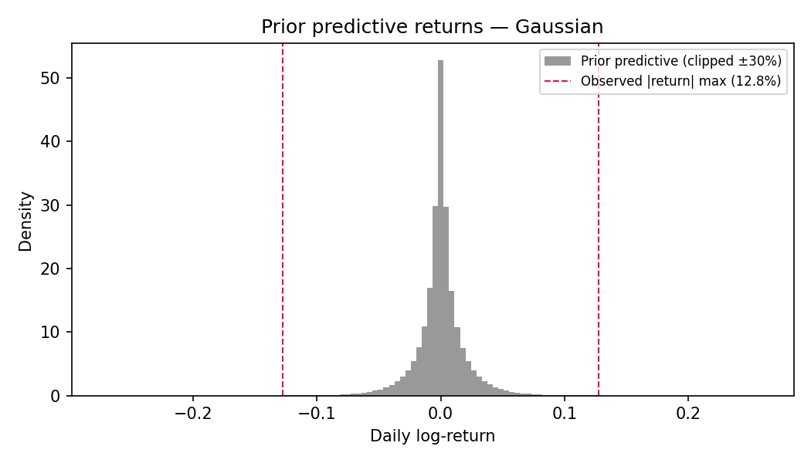

*Figure 1. Prior predictive returns for the Gaussian. The grey histogram is daily returns drawn from the prior alone, before the data is seen; the red lines mark the largest move in the actual sample (±12.8%). This is the tightest of the four.*

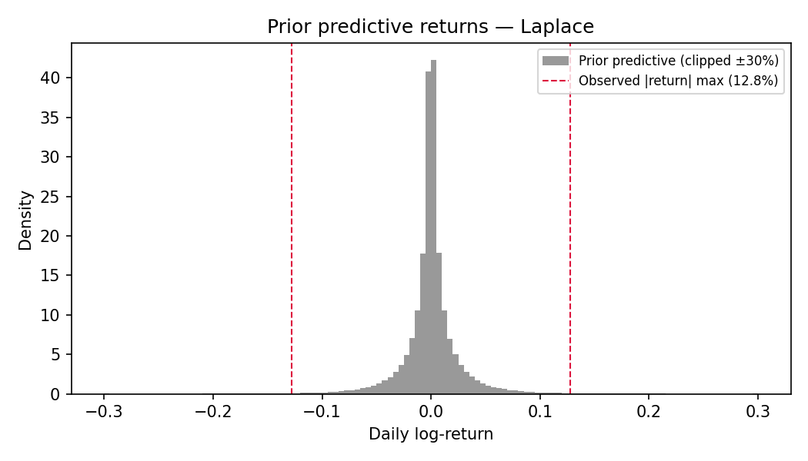

*Figure 2. Prior predictive returns for the Laplace. The symmetric tails reach further than the Gaussian, out to about ±16.7% at the 99.9% level.*

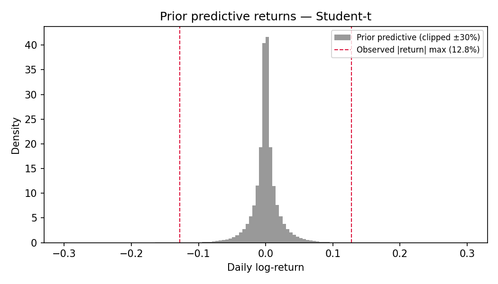

*Figure 3. Prior predictive returns for the Student-t. Tails sit between the Gaussian and the Laplace, reaching about ±12.4%.*

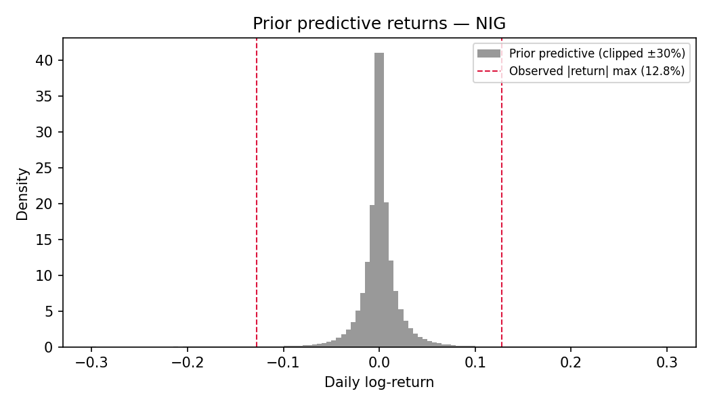

*Figure 4. Prior predictive returns for the NIG. The one asymmetric prior: its left tail stretches further than its right, the skew the β parameter allows.*

The fraction of simulated days beyond ±25%, a move bigger than anything in the sample, was 0.0001% for the Gaussian, 0.02% for the Student-t, 0.03% for the Laplace and 0.08% for the NIG. All four are negligible. Had any come back fat with absurd moves, I would have tightened the scale or tail prior and tried again. None did, so I sampled.

---

## 4. Sampling and convergence

I ran four chains for each model, with 1,000 tuning steps and 1,000 kept draws per chain. NUTS works by following the gradient of the log-density, which is straightforward for the Gaussian, Laplace and Student-t. The NIG was the real task. Its density contains a modified Bessel function, K₁, and the sampler needs the derivative of that. PyTensor supplies it, so I could code the NIG density directly instead of introducing the latent time-change variable the distribution is built from. I checked my version of the density against the one in scipy and they matched, which gave me confidence the gradient it was differentiating was the right one.

Every model converged cleanly. R-hat sat at 1.00 across the board, and the effective sample size never fell below about 2,000. Figures 5 to 8 show the traces. In each one the chains sit on top of each other on the left, and the raw draws on the right form a flat, stationary band with no drift and no chain wandering off, which is what good mixing looks like. The Gaussian and Laplace settle fastest, as their two-parameter posteriors should. The Student-t panel is the one I watch most closely, because it shows the ν chains circling steadily around 2.66 rather than creeping toward the ν = 2 boundary. The NIG, with four parameters and a Bessel function in its density, mixes just as well as the rest.

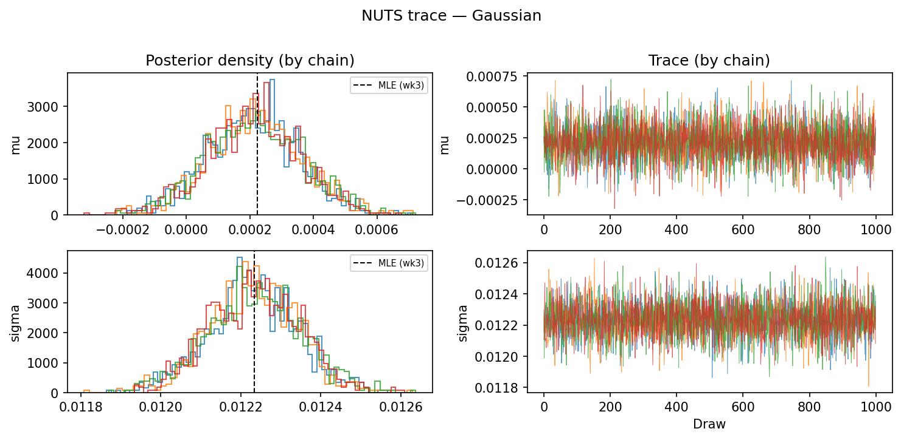

*Figure 5. NUTS diagnostics for the Gaussian. Left: the posterior for each parameter, one line per chain, with the Week 3 MLE dashed. Right: the raw chains.*

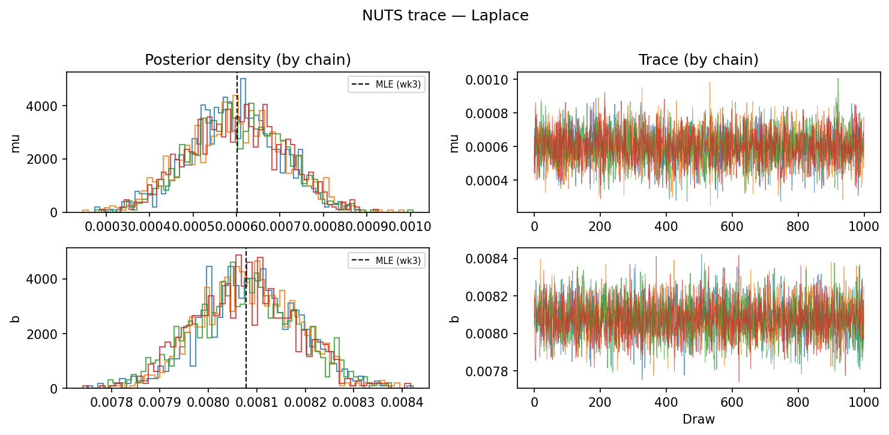

*Figure 6. NUTS diagnostics for the Laplace. Two parameters, fast and clean convergence.*

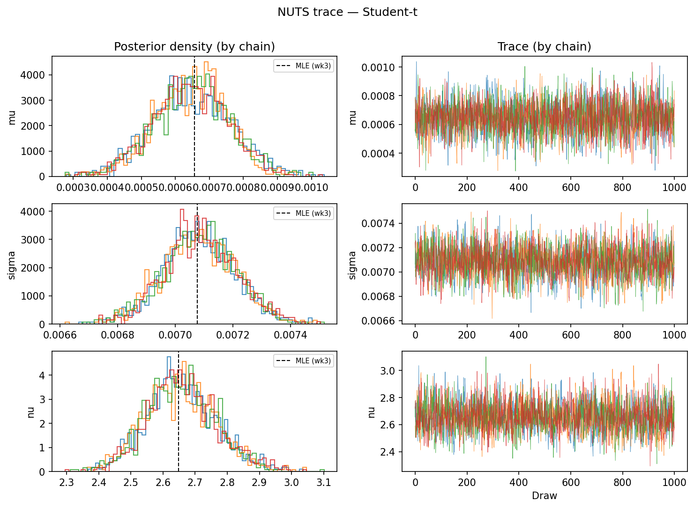

*Figure 7. NUTS diagnostics for the Student-t. The ν chains (bottom) circle around 2.66 and stay clear of the ν = 2 boundary.*

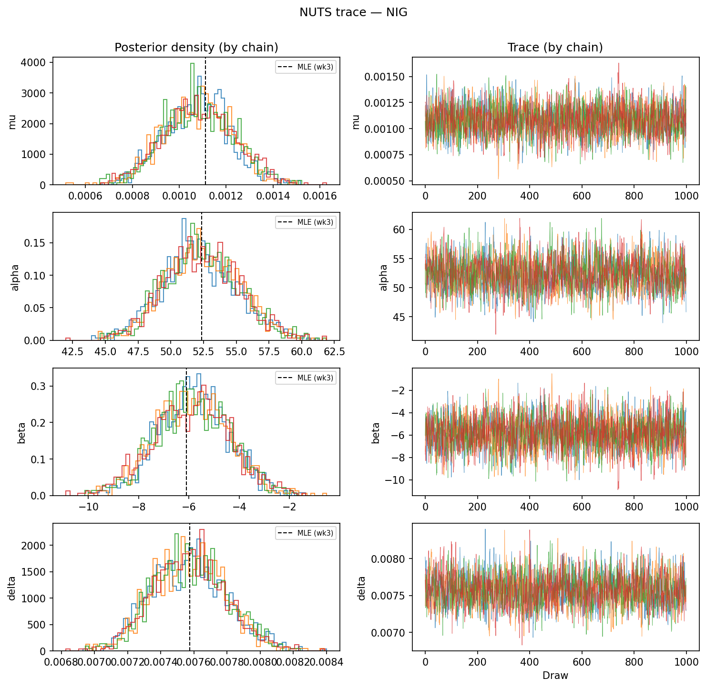

*Figure 8. NUTS diagnostics for the NIG. Four parameters and a custom Bessel-function density, and the chains still land on top of each other with flat, stationary traces.*

---

## 5. What the posteriors say

The posteriors come out almost exactly where the MLE did. With this much data and priors this loose, that is what should happen, and seeing it is reassuring rather than dull: it tells me the sampler and the MLE agree.

**Table 2. Posterior summaries against the Week 3 MLE. HDI (Highest Density Interval) is the 94% highest-density interval.**

| Model | Parameter | Posterior mean | 94% HDI | Week 3 MLE |
|-------|-----------|----------------|---------|------------|
| Gaussian | μ | +0.000215 | (−0.00007, +0.00049) | +0.000223 |
| | σ | 0.012233 | (0.01202, 0.01244) | 0.012234 |
| Laplace | μ | +0.000599 | (+0.00040, +0.00080) | +0.000602 |
| | b | 0.008081 | (0.00790, 0.00827) | 0.008078 |
| Student-t | μ | +0.000647 | (+0.00043, +0.00084) | +0.000656 |
| | σ | 0.007084 | (0.00686, 0.00733) | 0.007077 |
| | ν | 2.658 | (2.46, 2.87) | 2.648 |
| NIG | μ | +0.001080 | (+0.00081, +0.00135) | +0.001111 |
| | α | 52.35 | (47.1, 57.7) | 52.341 |
| | β | −5.86 | (−8.75, −3.25) | −6.095 |
| | δ | 0.007575 | (0.00717, 0.00798) | 0.007574 |

Two results are worth dwelling on.

The first is the Student-t ν. Its 94% interval runs from about 2.46 to 2.87, and the whole of it sits above 2. That is the question from Section 1 answered. The finite variance is not a fragile property of one point estimate that happens to land just north of the singularity. It holds across the entire credible range. The tails are genuinely heavy, and the variance is genuinely finite, both at once.

The second is the NIG asymmetry β. Every part of its interval is negative, from roughly −8.75 to −3.25. Week 3 reported a negative point estimate and read it as left skew. The posterior says that skew is a stable feature of the fit rather than something that could round away to zero. Losses sit in a heavier tail than gains, and the data is fairly firm about it.

---

## 6. Year-by-year VG and NIG fits

Everything so far, here and in Weeks 2 and 3, fits one set of parameters to the whole 2000–2024 sample. I refitted the Variance-Gamma and NIG densities by maximum likelihood one calendar year at a time, twenty-five fits each, and read the parameters as a time series.

Two choices shape these fits. First, the location is fixed at μ = 0. Within a single year there are only about 250 returns, the daily drift is tiny and barely identified, and leaving it free just adds a noisy nuisance parameter; pinning it to zero lets the scale, tail and asymmetry parameters carry the year's shape, and whatever small mean exists is absorbed by the asymmetry parameter (θ for VG, β for NIG), which is where it belongs. Second, the daily scale parameters σ and δ are reported annualised (× √252), so a year's scale reads on the same footing as the VIX and the Gaussian σ. The densities, the α > |β| reparametrisation and the standard errors are reused from the Week 3 code, so these yearly fits are numerically of a piece with the full-sample ones.

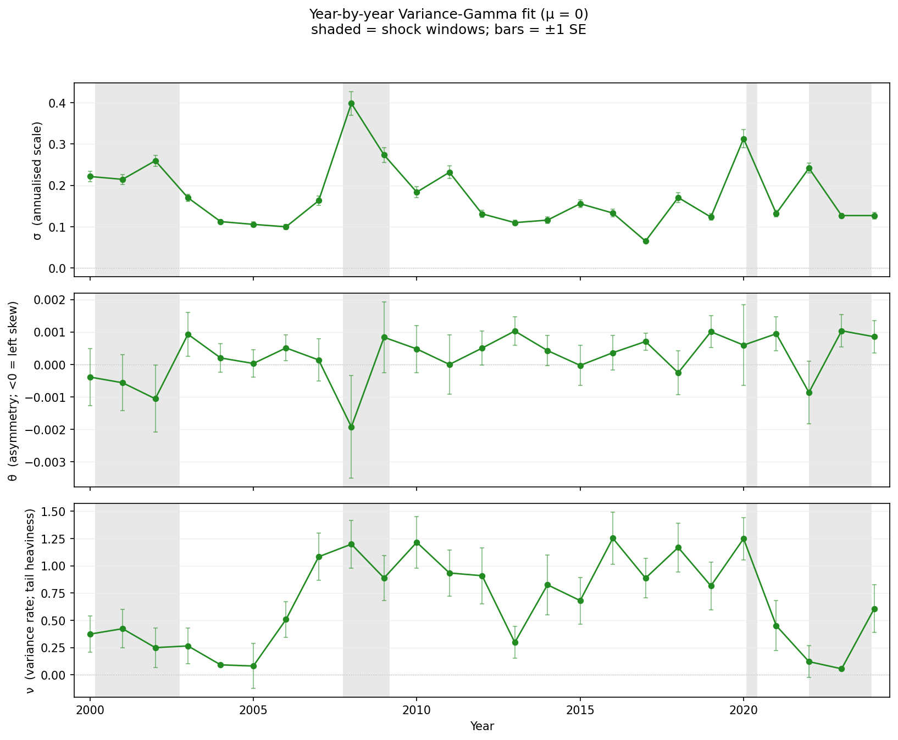

*Figure 9. Year-by-year Variance-Gamma fit (μ = 0). Top to bottom: the annualised scale σ, the asymmetry θ, and the variance rate ν (tail heaviness). Shaded bands are the four shock windows; bars are ±1 standard error.*

The VG scale moves with the crises. σ peaks in 2008 at 39.8% annualised and again in 2020 at 31.3%, the GFC and COVID years, and bottoms out in the calm of 2017 at 6.5%. The variance rate ν, which sets the tail heaviness, tends to run higher through the turbulent 2008 to 2020 stretch than in the quiet mid-2000s or the 2021 to 2023 years, though it is a good deal noisier than the scale.

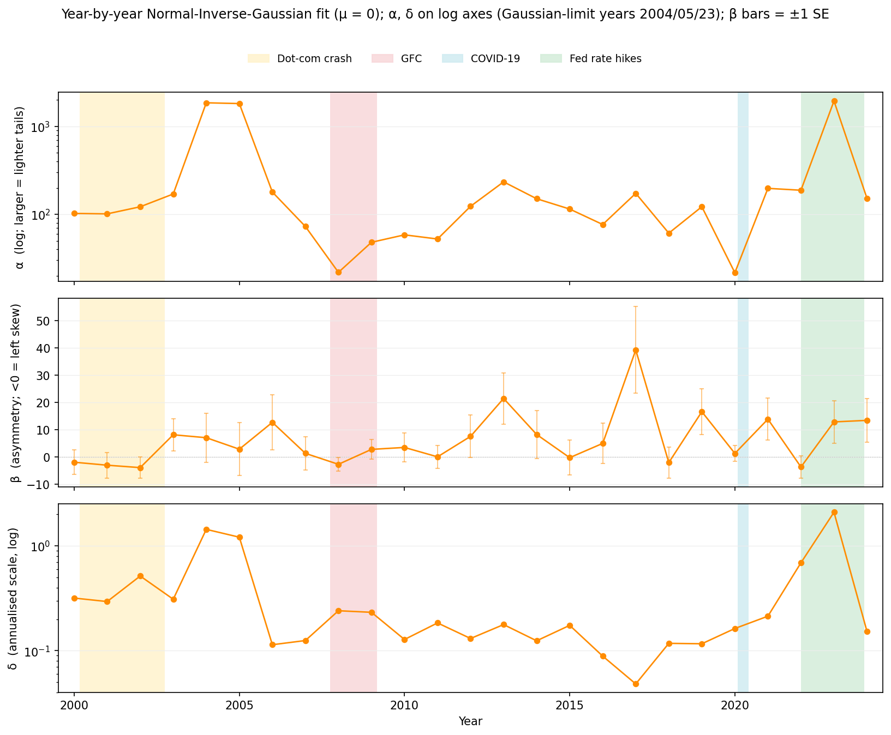

*Figure 10. Year-by-year Normal-Inverse-Gaussian fit (μ = 0). Tail-heaviness α and annualised scale δ are on log axes; asymmetry β is linear with ±1 SE bars. In the very calm years 2004, 2005 and 2023 the NIG runs into its Gaussian limit, where α and δ both grow large and are only weakly identified individually (the SEs there are enormous, so the bars are omitted on the log panels); their product stays finite and the tails are simply close to normal.*

The NIG says the same thing through its tail. In exactly 2008 and 2020, is the heaviest tails of the whole sample land on the two largest crises. In the calmest years the NIG drifts toward the Gaussian. The asymmetry β is most negative, most left-skewed, in 2001 to 2002, in 2008 and in 2022, the dot-com unwind, the GFC and the rate-hike drawdown. That matches the full-sample posterior in Section 5, which put β firmly below zero.

The two models agree. Tail heaviness and scale are not fixed features of the market; they rise sharply in crises and settle back in calm years, and the negative skew bunches into the stressed periods. 

Figures 9 and 10 track the parameters; Figures 11 to 15 show the fitted densities they produce, one panel per year against that year's empirical distribution, in the same five-year-block layout as the Week 2 marginals. Each panel shades its background with the shock window the year belongs to, overlays the fitted VG (green) and NIG (orange dashed) densities on the empirical kernel estimate, and prints the year's annualised scale together with the two tail parameters. The crisis years stand out by eye: 2008 and 2020 have the sharpest peaks and the longest tails, the calm years are visibly closer to normal, and the two Lévy densities sit almost on top of each other throughout, which is why the choice between them turns on tail risk rather than overall shape.

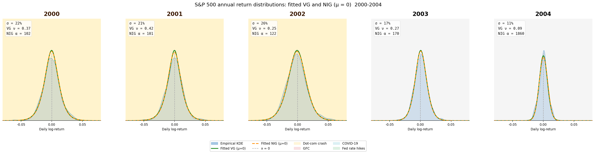

*Figure 11. Per-year empirical distribution (kernel estimate) with fitted VG and NIG densities (μ = 0), 2000–2004. Panel backgrounds mark the shock windows; each panel prints the annualised scale σ, the VG ν, and the NIG α.*

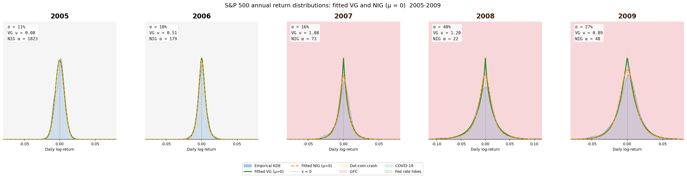

*Figure 12. As Figure 11, for 2005–2009. The GFC years 2008–2009 carry the sharpest peaks and heaviest tails of the block.*

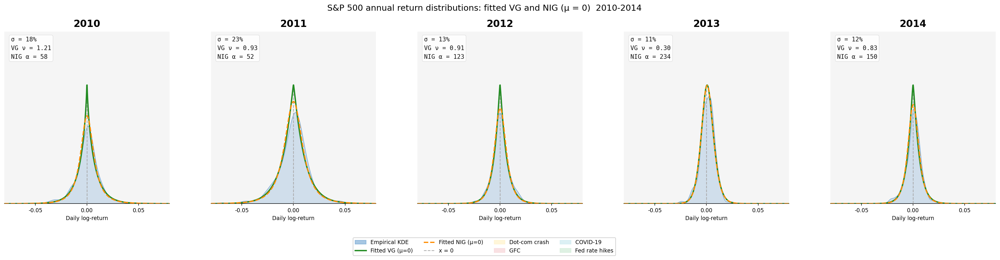

*Figure 13. As Figure 11, for 2010–2014.*

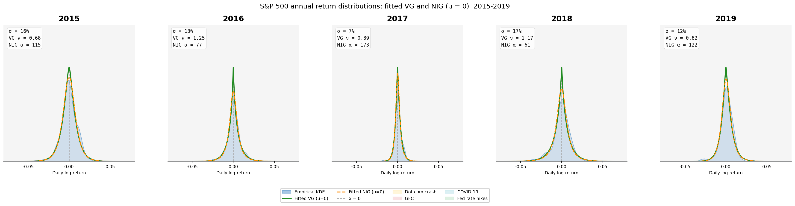

*Figure 14. As Figure 11, for 2015–2019.*

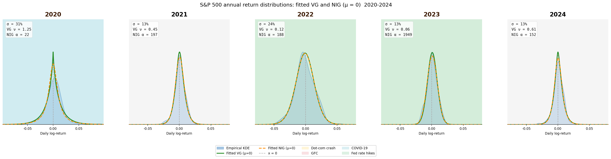

*Figure 15. As Figure 11, for 2020–2024. The COVID year 2020 has the most extreme peak-and-tail shape of the whole sample.*

---

# Week 5: Posterior predictive checks and convergence diagnostics

## 1. How the check works

I have a posterior over parameters. For each draw from that posterior I generate a complete replicate dataset the same size as the real one, 6,287 returns, from that draw's likelihood. Do this for a thousand draws and I have a thousand fake histories, each one a fair sample of what the fitted model thinks the market should produce. Then I compare the real data against that cloud.

I did this in numpy and scipy rather than rebuilding the models in PyMC, because Week 4 already saved every posterior draw to CSV. Reading those back and sampling the likelihood at each one gives the same thing without re-running the sampler.

Value at risk and expected shortfall at 95%, 97.5% and 99% are the risk numbers the project actually reports, computed on each replicate exactly as they are on the real series; 97.5% is included because it is the ES confidence level FRTB mandates for regulatory capital. For each statistic I get its spread across the thousand replicates, and I score the fit with a two-sided posterior predictive p-value: the probability that a replicate is at least as extreme as the observed value. A p near 0.5 means the model produces data with that feature comfortably. A p near 0 or 1 means the real data sits out past almost every replicate, and the model cannot reach it. I flag anything below 0.05 or above 0.95.

I also included one statistic knowing every model will fail it: the lag-1 autocorrelation of squared returns, the standard measure of volatility clustering (Cont, 2001). All four models are fitted as independent draws from a fixed distribution, so their replicates cannot cluster by construction. The real series does. Every other statistic in the table is a property of the histogram, which is what these models were built to describe; this one tests the dynamics, and it shows where the static approach stops working. The Week 3 lead-up regression made the same point from the other direction: trailing volatility alone explains 44% of forward volatility, and that is exactly the dependence an iid model throws away.

---

## 2. Gaussian

Figure 1 shows the Gaussian's replicate densities in blue with the real data in black, and the right panel zooms into the left tail on a log scale. The Gaussian was fitted to a daily volatility near 1.2% and it reproduces that. The tail panel is where it falls apart. The real density still has visible mass out past −5%, and the Gaussian replicates have effectively none.

The statistics say the same thing. Observed excess kurtosis is 10.4; the Gaussian replicates run between −0.11 and +0.12, as a normal distribution must. The real worst day is −12.8%; the worst day the Gaussian manages across a thousand replicate histories sits around −5%. Both p-values are below 1/1,000; no replicate came close. The risk numbers carry the same verdict in the units the project cares about: observed 99% expected shortfall is −5.07%, and the Gaussian replicates put it near −3.24%; at the FRTB level the observed 97.5% expected shortfall is −3.79% against replicates near −2.83%. The 79.5% shortfall gap from Week 2 is not an artefact of one estimator. It is the Gaussian being structurally unable to generate the losses the market actually delivered.

At 95% value at risk the Gaussian is not too thin but slightly too fat: observed −1.88% against a replicate −1.99%. That is the flip side of forcing a single bell curve onto a peaked, heavy-tailed sample. To cover the fat middle the fitted variance has to stretch, which pushes the ordinary 95% quantile out a little too far. It is only when you go further into the tail, to 99% and to expected shortfall, that the missing mass shows up and the Gaussian collapses.

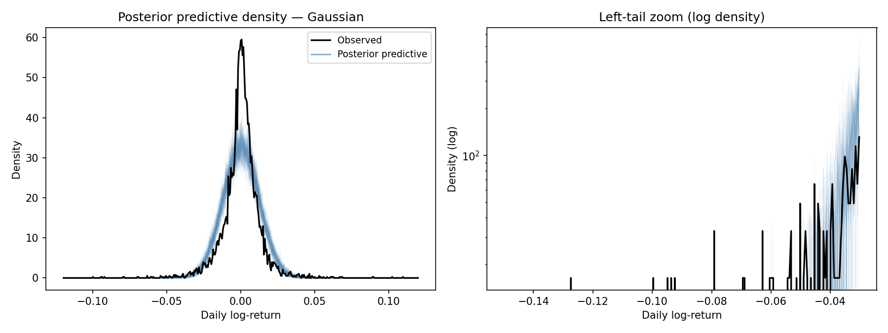

*Figure 1. Posterior predictive check for the Gaussian. Left: replicate return densities (blue) against the observed data (black). Right: the left tail on a log scale, where the observed mass past −5% has no counterpart in the replicates.*

---

## 3. Laplace

The Laplace is my Variance-Gamma model. Figure 2 is a clear step up from the Gaussian. Its tails reach much further, and its 95% value at risk now matches the data (p = 0.13).

It still fails the deep tail. Observed excess kurtosis is 10.4 against replicates near 2.9, which is exactly the kurtosis a Laplace has by construction. Its 99% expected shortfall lands near −3.89% against the observed −5.07%, better than the Gaussian's −3.24%.

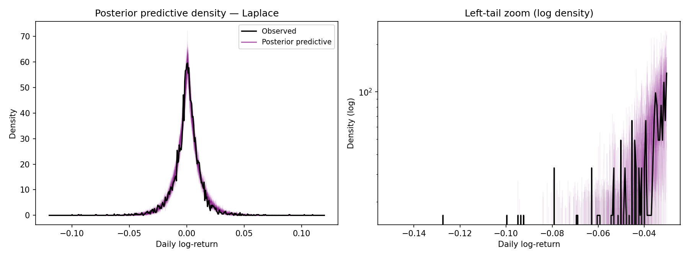

*Figure 2. Posterior predictive check for the Laplace. The exponential tails reach much further than the Gaussian's but still fall short of the observed mass in the deep left tail.*

---

## 4. Student-t

The Student-t is the first model where it gets the deep tail correct. Its 99% value at risk matches the data almost exactly (p = 0.94), and its 99% expected shortfall covers the observed −5.07% comfortably.

Observe the excess kurtosis in Figure 3 and Table 1. The replicate median is about 49, and the 94% band runs from 14 all the way to 1,200. The observed 10.4 sits below almost all of it. The posterior for ν sits around 2.66, and a Student-t only has finite kurtosis when ν exceeds 4.

For a genuinely heavy-tailed model, moment-based checks like kurtosis are close to meaningless, because the moment they measure does not exist in the population. The quantile-based checks, value at risk and expected shortfall, stay well defined no matter how heavy the tail, and those are the ones the Student-t passes. The same caution applies to its skew "pass" (p = 0.81). The observed −0.39 falls inside the band only because the replicate skew ranges from −10.7 to +11.8: a symmetric model whose third moment barely exists produces sample skews so erratic that almost any value would pass. That pass is degenerate, not evidence that the Student-t captures the asymmetry.

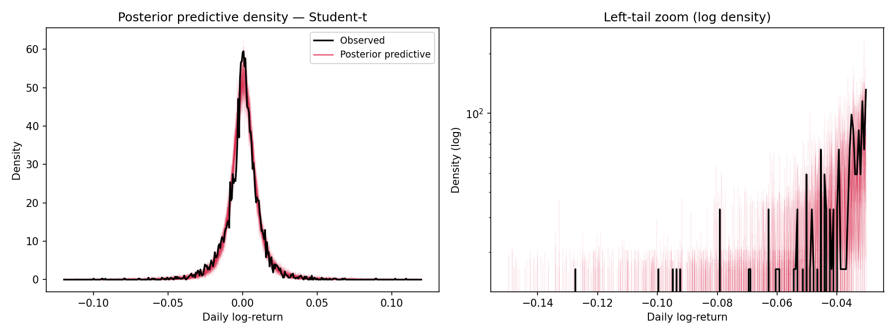

*Figure 3. Posterior predictive check for the Student-t. The tails now cover the observed data, but with ν near 2.66 the replicate tails are so heavy that the densest part of the figure is dominated by occasional extreme replicates.*

---

## 5. NIG

The NIG passes every marginal check. Each distributional statistic I tested falls inside its replicate band: standard deviation (p = 0.82), excess kurtosis (p = 0.21), skew (p = 0.56), the minimum and maximum, and value at risk and expected shortfall at all three levels, including the FRTB 97.5% (observed ES −3.79% against a replicate median of −3.93%). Its 99% expected shortfall is −5.17% against the observed −5.07%. Figure 4 shows replicate densities sitting on the data through the body and into both tails, and unlike the Student-t its kurtosis is finite and stable.

The skew result is the one I find most satisfying. The replicate skew is centred at −0.54 against the observed −0.39, and the band is tight enough for the pass to mean something (unlike the Student-t's). The model is not just heavy-tailed in a symmetric way.

The NIG fails one statistic, the same one every model fails: the lag-1 autocorrelation of squared returns. The observed value is 0.32 and the replicate bands of all four models sit on zero, because independent draws cannot cluster. That says nothing about the NIG relative to the others. A fixed distribution can get the size of tail risk right, which the NIG demonstrably does, but it cannot say when that risk arrives; the arrival times are the volatility clustering the iid assumption discards.

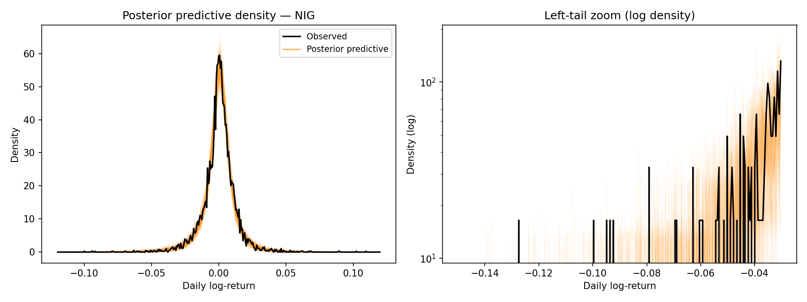

*Figure 4. Posterior predictive check for the NIG. Replicate densities track the observed data through the body and into both tails, with the heavier left tail reproduced rather than assumed.*

Figure 5 puts the risk numbers side by side. For each of value at risk and expected shortfall at 95%, 97.5% and 99% it draws each model's replicate band against the observed value as a dashed line. The Gaussian band sits clear of the dashed line in the 97.5% and 99% panels, the Laplace closes about half the distance, and the Student-t and NIG bands straddle it. The picture is the Week 2 shortfall gap drawn in posterior-predictive form, with the NIG the only model whose band covers the truth on all six.

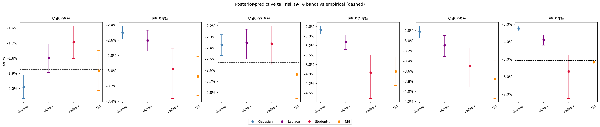

*Figure 5. Posterior predictive value at risk and expected shortfall at 95%, 97.5% (the FRTB ES level) and 99%. Each marker is a model's replicate median with its 94% band; the dashed line is the observed value. The Gaussian misses badly beyond 95%; the NIG covers all six.*

**Table 1. Posterior predictive p-values by model. Values near 0.5 indicate the model reproduces that feature; values flagged with † sit beyond 0.05 or 0.95, where the observed data lies outside almost all replicates. ACF²(1) is the lag-1 autocorrelation of squared returns, the volatility clustering statistic that no iid model can reproduce.**

| Statistic | Gaussian | Laplace | Student-t | NIG |
|-----------|----------|---------|-----------|-----|
| Std deviation | 0.99 † | 0.00 † | 0.05 | 0.82 |
| Excess kurtosis | 0.00 † | 0.00 † | 0.00 † | 0.21 |
| Skew | 0.00 † | 0.00 † | 0.81 | 0.56 |
| Minimum | 0.00 † | 0.00 † | 0.22 | 0.36 |
| Maximum | 0.00 † | 0.01 † | 0.05 | 0.28 |
| ACF²(1) | 0.00 † | 0.00 † | 0.00 † | 0.00 † |
| VaR 95% | 0.01 † | 0.13 | 0.00 † | 0.93 |
| ES 95% | 0.00 † | 0.00 † | 0.92 | 0.55 |
| VaR 97.5% | 0.00 † | 0.03 † | 0.08 | 0.37 |
| ES 97.5% | 0.00 † | 0.00 † | 0.52 | 0.50 |
| VaR 99% | 0.00 † | 0.00 † | 0.94 | 0.16 |
| ES 99% | 0.00 † | 0.00 † | 0.23 | 0.73 |

---

## 6. Convergence diagnostics

Because the posterior predictive check relies on the posterior draws being trustworthy, I revisited the draws themselves with more scrutiny than the Week 4 trace plots provided. Working directly from the saved chains rather than through a library, I computed four diagnostics: split R-hat, which compares within-chain to between-chain variance and should equal 1.00 once the chains agree; bulk effective sample size, which indicates how many independent draws the correlated chain is effectively worth for estimating the posterior's centre; tail effective sample size, the same concept applied to the 5% and 95% indicators so that it reflects the quantiles; and the Monte Carlo standard error on each posterior mean.

Table 2 has the numbers. Every R-hat rounds to 1.00. Bulk ESS never drops below ~2,000, and tail ESS stays above 2,100 across the board. The tail figure is the one that actually matters here. The quantities I'm reporting are tail quantiles, and a posterior mean is only as good as the effective sample behind its tail. Monte Carlo standard errors are small next to the posterior spread. Figure 6 shows the chains for all four models: flat, stationary, sitting right on top of each other, which is just the table again but easier to read.

**Table 2. Convergence diagnostics, computed directly from the saved chains.**

| Model | Parameter | R-hat | Bulk ESS | Tail ESS | MCSE |
|-------|-----------|-------|----------|----------|------|
| Gaussian | μ | 1.00 | 3,973 | 2,626 | 2.4e-06 |
| | σ | 1.00 | 3,323 | 2,300 | 2.0e-06 |
| Laplace | μ | 1.00 | 3,844 | 2,531 | 1.7e-06 |
| | b | 1.00 | 3,670 | 2,944 | 1.7e-06 |
| Student-t | μ | 1.00 | 2,574 | 2,505 | 2.2e-06 |
| | σ | 1.00 | 2,520 | 2,232 | 2.5e-06 |
| | ν | 1.00 | 2,326 | 2,328 | 2.3e-03 |
| NIG | μ | 1.00 | 2,251 | 2,428 | 3.1e-06 |
| | α | 1.00 | 2,074 | 2,138 | 6.3e-02 |
| | β | 1.00 | 2,089 | 2,315 | 3.2e-02 |
| | δ | 1.00 | 2,085 | 2,430 | 4.8e-06 |

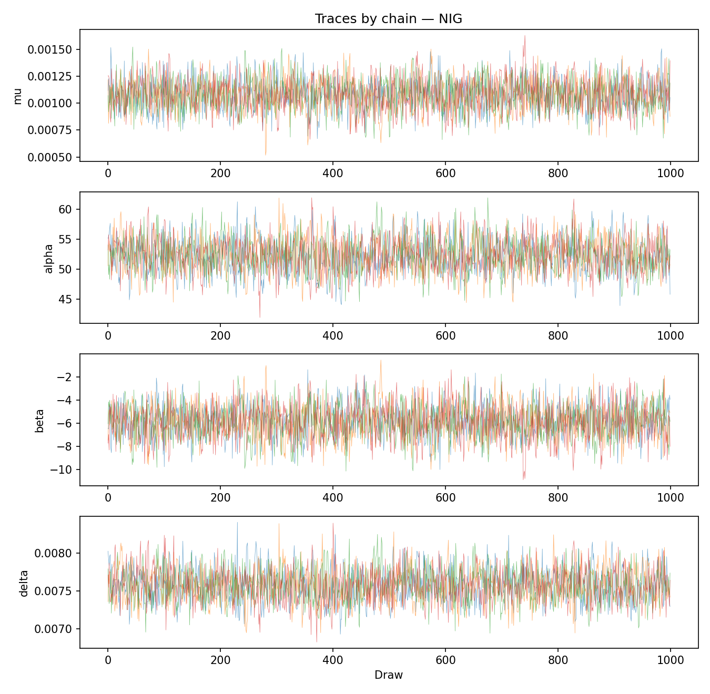

*Figure 6. Per-chain traces for the NIG.*

---

## 7. Where this leaves the project

The NIG reproduces every marginal feature of the data: the body, both tails, the skew, and the risk numbers at all three confidence levels including the FRTB 97.5%. The Student-t gets the tail quantiles right but has moments too heavy to pin down. The Laplace closes part of the Gaussian's gap but stops at exponential tails. The Gaussian fails the moment the test moves past the centre of the distribution. This confirms the Week 2 shortfall by a different route.

What no static model reproduces is the clustering. All four fail the squared-return autocorrelation check, because independent draws cannot produce the market's long calm stretches broken by turbulent ones. So the summary has two parts: the NIG gets the size of tail risk right, and no fixed marginal gets the timing. Whether re-estimating the parameters through time is enough to fix the timing is the question for Weeks 6 and 7. Christoffersen's independence test catches the clustered VaR violations a fixed model produces, and the rolling window gives each model its chance to pass.
