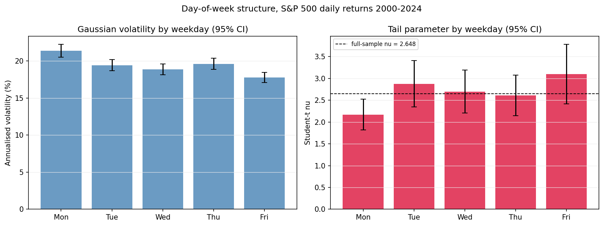
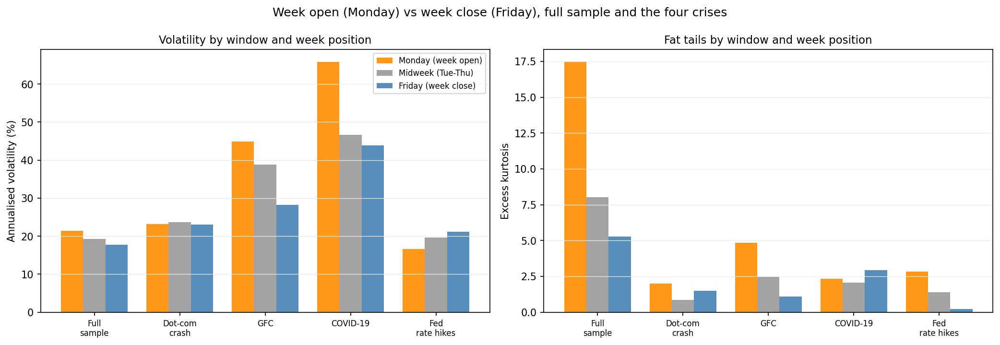
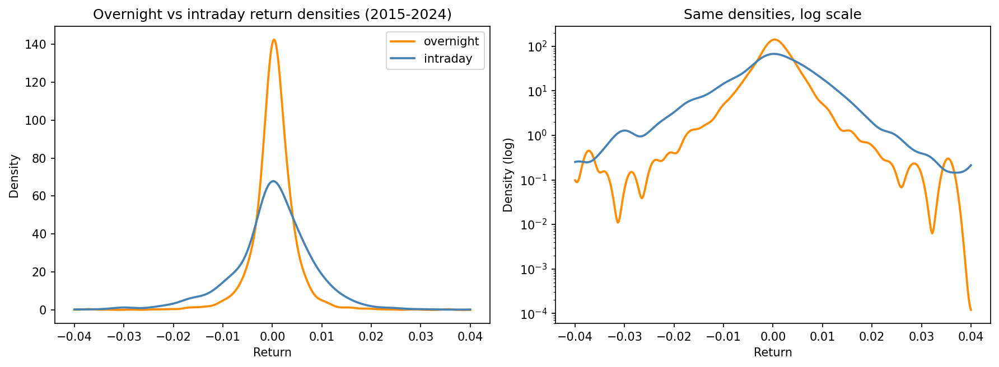
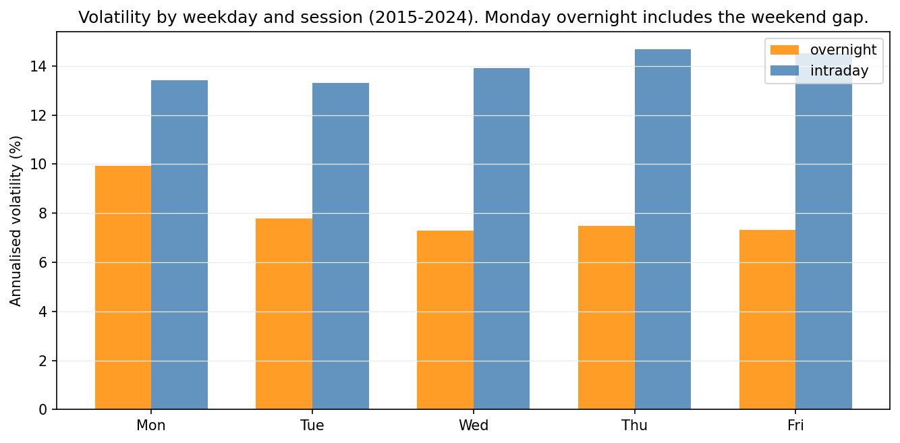
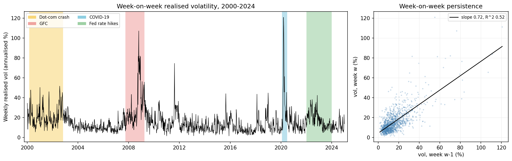
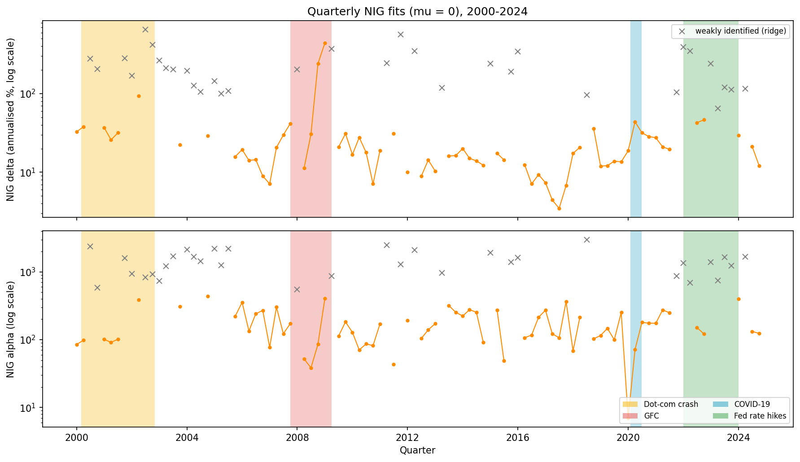
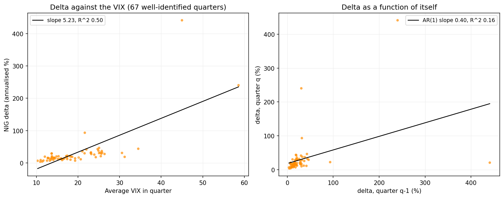
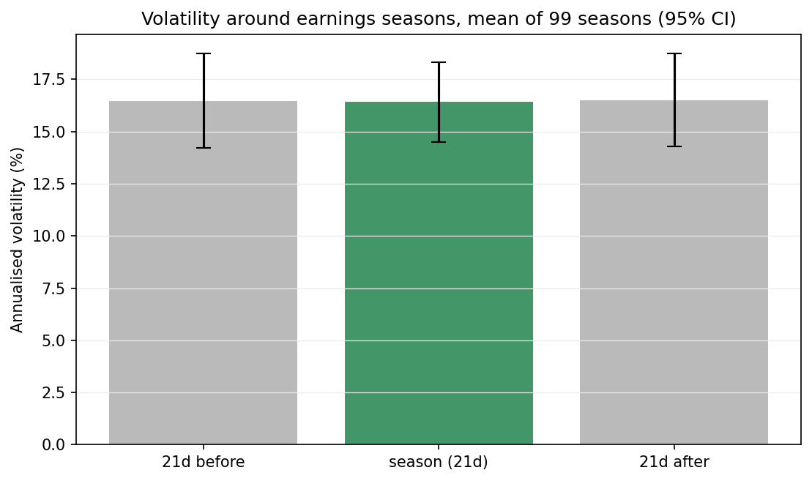

# Week 6 results: the calendar structure of returns

## 1. Overview

This week I looked at the same 6,287 daily S&P 500 log-returns from a different angle: the calendar. Instead of asking what distribution fits the returns, I asked when the risk actually shows up. Four questions:

1. Does the day of the week matter, and is the right way to cut the week Monday / midweek / Friday, or is the week just one block?
2. How does volatility split between the market being open (intraday) and closed (overnight), and what does the week-open (Monday) to week-close (Friday) picture look like inside each of our four crises?
3. Can I explain the fitted Lévy parameters with a regression, one parameter at a time, starting with the NIG δ?
4. Do quarterly earnings seasons move index volatility?

Short answers: yes, Monday / midweek / Friday is exactly the right cut; the market is only open for three fifths of its variance and almost none of its jumps; δ is mostly a VIX story and the skew parameters turn out to follow the VIX too once there is enough data. Earnings season was perhaps the most weakly informative out of all the tests, and does nothing at the index level. However, this turned out to be the most interesting null of the project so far.

---

## 2. The shape of the week

I fitted the Gaussian and the Student-t to each weekday separately. Note: a Monday return runs from Friday's close to Monday's close, so the whole weekend is inside it.

**Table 1. Per-weekday MLEs, 2000-2024. Mean in basis points per day, σ annualised.**

| Day | n | Mean (bp) | σ (ann.) | Student-t ν | SE(ν) | Excess kurtosis |
|-----|---|-----------|----------|-------------|-------|-----------------|
| Monday | 1,178 | +0.1 | 21.4% | 2.17 | 0.18 | 17.5 |
| Tuesday | 1,289 | +5.5 | 19.4% | 2.88 | 0.27 | 8.7 |
| Wednesday | 1,290 | +1.6 | 18.9% | 2.70 | 0.25 | 6.9 |
| Thursday | 1,268 | +3.4 | 19.6% | 2.61 | 0.24 | 8.3 |
| Friday | 1,262 | +0.3 | 17.8% | 3.10 | 0.35 | 5.3 |

The means are all statistically zero. The interesting rows are the second moments. 

Monday is the most volatile day and has by far the heaviest tail: ν = 2.17, close enough to the ν = 2 boundary that its confidence interval brushes against infinite variance. Friday is the calmest and lightest day on every measure.

The plan asked me to compare two definitions of the week, and the likelihood-ratio tests settle it:

**Table 2. Gaussian likelihood-ratio tests between week definitions.**

| Comparison | LR | df | p |
|------------|----|----|---|
| Mon / midweek / Fri vs one pooled week | 42.9 | 4 | < 0.0001 |
| Five separate days vs one pooled week | 45.7 | 8 | < 0.0001 |
| Five separate days vs Mon / midweek / Fri | 2.8 | 4 | 0.594 |

Splitting it all the way into five days is not very effective. So Monday / midweek / Friday is the right resolution: Tuesday, Wednesday and Thursday are statistically the same day, and the week's real structure is its open, its middle and its close.

Volatility falls from 21.4% (Monday) to 19.3% (midweek) to 17.8% (Friday). Excess kurtosis falls from 17.5 to 8.0 to 5.3. The tail parameter rises from ν = 2.17 to 2.73 to 3.10. Every measure says the same thing: the week opens risky and heavy-tailed, and calms down as it goes.

*Figure 1. Left: annualised Gaussian volatility by weekday with 95% intervals. Right: Student-t ν by weekday against the full-sample 2.648.*

---

## 3. The week inside each crisis

Next I ran the same week-open (Monday) to week-close (Friday) lens through each of the four crisis windows, measuring volatility, variance and the fat-tail measures in each. 

COVID has only about 20 Mondays and 20 Fridays, so I report volatility, variance and kurtosis. However, due to lack of data I cannot fit a Student-t to those two groups properly.

**Table 3. Week open vs midweek vs week close, full sample and per crisis. Variance is the daily variance in %². ν is omitted where n < 50.**

| Window | Group | n | σ (ann.) | Daily var (%²) | Excess kurt | Worst day | ν |
|--------|-------|---|----------|----------------|-------------|-----------|---|
| Full sample | Monday | 1,178 | 21.4% | 1.81 | 17.5 | −12.8% | 2.17 |
| | Midweek | 3,847 | 19.3% | 1.48 | 8.0 | −10.0% | 2.73 |
| | Friday | 1,262 | 17.8% | 1.25 | 5.3 | −6.0% | 3.10 |
| Dot-com crash | Monday | 127 | 23.1% | 2.12 | 2.0 | −5.0% | 4.78 |
| | Midweek | 409 | 23.7% | 2.23 | 0.9 | −4.2% | 7.43 |
| | Friday | 135 | 23.1% | 2.11 | 1.5 | −6.0% | 7.10 |
| GFC | Monday | 73 | 44.8% | 7.98 | 4.8 | −9.4% | 2.01 |
| | Midweek | 229 | 38.8% | 5.99 | 2.5 | −9.5% | 2.79 |
| | Friday | 76 | 28.2% | 3.16 | 1.1 | −4.3% | 7.59 |
| COVID-19 | Monday | 20 | 65.9% | 17.2 | 2.3 | −12.8% | |
| | Midweek | 64 | 46.7% | 8.65 | 2.1 | −10.0% | 2.42 |
| | Friday | 20 | 43.9% | 7.63 | 3.0 | −4.4% | |
| Fed rate hikes | Monday | 90 | 16.7% | 1.10 | 2.8 | −4.0% | 2.64 |
| | Midweek | 309 | 19.6% | 1.53 | 1.4 | −4.4% | 8.10 |
| | Friday | 102 | 21.1% | 1.77 | 0.2 | −3.7% | 15.5 |

The four crises do not treat the week the same way, and the differences line up with what Week 3 found about the crises themselves.

The GFC is the extreme case. Monday volatility was 44.8% against Friday's 28.2%, so the variance of a GFC Monday was two and a half times the variance of a GFC Friday. The crisis was hitting hardest right as the week opened, after the weekend's bank failures and rescue announcements had piled up with no trading to absorb them.

COVID shows the same shape even more sharply in volatility terms: 65.9% on Mondays against 43.9% on Fridays, and the single worst day of the whole 25-year sample, the −12.8% of 16 March 2020, was a Monday. 

The dot-com crash is completely flat: 23.1%, 23.7%, 23.1% across the three groups, with mild tails throughout. That fits its character from Week 3. It was a longer protracted crisis rather than a sequence of weekend shocks, so it would not be as affected by day-to-day movements.

The Fed rate-hike window is the surprise: the pattern reverses. Mondays were the calm days (16.7%) and Fridays the risky ones (21.1%). My reading is that this crisis ran on scheduled announcements rather than weekend surprises, and the big macro releases, CPI and the payrolls report, land on weekday mornings, with payrolls on Fridays. When the risk arrives by calendar appointment, the weekend stops mattering and the week's shape flips. The tail numbers back this up, those risky Fridays fit at ν = 15.5 with excess kurtosis of just 0.2, so the announcement volatility was big but nearly Gaussian. Scheduled news makes the market wide, not fat-tailed.

So the full-sample Monday effect in Section 2 is really a crisis effect. It is driven by the GFC and COVID, absent in the dot-com years, and reversed in 2022-23.

*Figure 2. Annualised volatility (left) and excess kurtosis (right) for Monday, midweek and Friday, over the full sample and inside each crisis window.*

---

## 4. Market open vs market closed within the day

The other meaning of open versus closed is within a single day. The close-to-close return splits exactly into an overnight part (yesterday's close to today's open, while the market is shut) and an intraday part (open to close, while it is trading):

r_close-to-close = r_overnight + r_intraday

One data problem first. Yahoo's ^GSPC open prices are fake in the early sample. A real index almost never opens exactly where it closed, since futures move overnight, so when the open equals the previous close it means the vendor had no true open and just copied the prior close into the column. I flag a day as stale when |ln(O_t / C_{t-1})| < 10^-8. The script recomputes this audit every time it runs, and the fractions come out at 96.3% of days in 2000-2004, 31.4% in 2005-2009, 12.4% in 2010-2014, and 0.08% from 2015 on. Running the overnight and intraday split on the early data would therefore give an overnight return of exactly zero on nearly every day of 2000-2004. That zero is a vendor artifact, and it would sit as a huge spike at the origin in every distributional estimate this section makes.

There is no repairing the bad opens; the true opening levels were simply never recorded in this data. So this section restricts itself to 2015-2024, where the opens are real. That leaves n = 2,515 trading days, plenty for estimation, and the leftover 0.08% is 2 days whose overnight return happens to be exactly zero, which has no impact. Nothing else in the project is touched. This is the only analysis that reads the open column, and everything else runs on closing prices, which are the official end-of-day index levels and reliable over the whole 25 years. Everything below describes 2015-2024, and pushing the split further back would take a better data source for the early opens rather than a different method.

**Table 4. Return components, 2015-2024.**

| Component | σ (ann.) | Variance share | Student-t ν | Excess kurtosis | Skew |
|-----------|----------|----------------|-------------|-----------------|------|
| Close-to-close | 17.9% | 100% | 2.68 | 15.7 | −0.81 |
| Overnight (closed) | 8.0% | 20.0% | 2.14 | 36.1 | −1.76 |
| Intraday (open) | 14.0% | 61.0% | 2.79 | 5.2 | −0.41 |

The two shares add to 81%; the missing 19% is twice the covariance, because the components correlate at +0.27 and overnight moves tend to continue into the day.

The split is lopsided in a way I find really satisfying. The open market carries three times the closed market's variance, but the closed market carries the tails. Overnight returns fit at ν = 2.14 with excess kurtosis of 36 and skew of −1.8. Intraday returns are comparatively tame: ν = 2.79, kurtosis 5. The reason seems clear enough: while the market is shut, news piles up and nothing can be traded against it, so it all lands at once at the open. That is a jump. And the whole project has been about jumps, so it is nice to find out what time of day they happen: mostly while nobody can trade.

*Figure 3. Overnight and intraday return densities, 2015-2024, on a linear and a log scale. The overnight density is narrower in the middle but crosses over in the tails.*

The two calendar effects also meet exactly where they should. Monday's overnight component runs at about 10% annualised against 7.3 to 7.8% for the other days. That extra piece is the weekend gap from Sections 2 and 3, now located in the specific session where it accrues.

*Figure 4. Annualised volatility by weekday, split into overnight and intraday. The weekend lives in Monday's overnight bar.*

---

## 5. Week-on-week volatility

For the week-on-week measure I built weekly realised volatility (the root of each week's summed squared daily returns, annualised) over the full 2000-2024 sample, 1,302 weeks.

Volatility carries over strongly from one week to the next: vol_w = 4.30 + 0.72 × vol_(w−1), with R² = 0.52. A calm week is usually followed by a calm week and a wild one by a wild one. This is the weekly version of the volatility clustering that the Week 5 posterior predictive check showed none of our static models can produce.

The Student-t fitted to weekly returns gives ν = 3.38 (SE 0.35) against the daily 2.648. One step of aggregation already lightens the tail by a measurable amount, though weekly returns are still nowhere near Gaussian.

*Figure 5. Left: weekly realised volatility, 2000-2024, with the four crisis windows shaded. Right: each week's volatility against the previous week's, slope 0.72, R² 0.52.*

---

## 6. Quarterly parameter regressions

The central item of the plan: fit the Lévy models through time and regress each parameter separately. Yearly fits only give 25 data points, so I refitted VG(σ, θ, ν) and NIG(α, β, δ) with μ = 0 one calendar quarter at a time. That gives 100 quarters of roughly 63 returns each, using the same zero-mean machinery as the Week 4 yearly fits.

One thing has to be dealt with before any regression. In calm quarters the NIG cannot tell itself apart from a Gaussian, α and δ both blow up together, and only their ratio is pinned down by the data. The individual values of α and δ in those quarters are meaningless. This happens in 33 of the 100 quarters (I flagged any quarter with α above 500), so the δ regressions run on the 67 quarters where δ actually means something. The fact that a third of all quarters look Gaussian is a finding in itself: it repeats the Week 3 message that heavy tails are something markets do in episodes, not all the time.

**Table 5. One regression per parameter. Newey-West standard errors, 4 lags. The full specification adds realised volatility, drawdown and the parameter's own lag to the VIX.**

| Parameter | R² (VIX only) | VIX t-stat | R² (full) | AR(1) slope | AR(1) R² |
|-----------|---------------|------------|-----------|-------------|----------|
| NIG δ (ann., 67 quarters) | 0.50 | +3.0 | 0.60 | +0.40 | 0.16 |
| NIG log α | 0.02 | −1.3 | 0.24 | +0.26 | 0.07 |
| NIG β | 0.17 | −3.2 | 0.28 | −0.01 | 0.00 |
| VG σ (ann.) | 0.82 | +19.9 | 1.00 | +0.52 | 0.27 |
| VG θ | 0.19 | −5.1 | 0.65 | +0.04 | 0.00 |
| VG ν | 0.04 | −2.1 | 0.22 | +0.19 | 0.04 |

Against the VIX alone, δ gives R² = 0.50 in levels. In logs, which stops a few crisis quarters from dominating the fit, it reaches R² = 0.64 with a t-statistic of 9.7. The NIG's scale parameter is, to a decent approximation, a re-reading of the VIX. The VG σ says the same even louder: R² = 0.82 with 100 quarters, matching the 0.90 that Week 3 found with 25 years. (The R² of 1.00 in σ's full specification is not impressive, it is circular: quarterly realised volatility and the fitted VG scale are almost the same number, so one explains the other perfectly. I kept the row only for completeness.)

The genuinely new result is the skew. The Week 3 annual regression found no relationship between the VIX and either asymmetry parameter, with p-values of 0.60 and 0.16 on 25 points. With 100 quarters both show up clearly: VG θ at t = −5.1 and NIG β at t = −3.2. Higher-VIX quarters are more left-skewed quarters. The annual nulls were a sample-size problem, which the Week 3 limitations section suspected at the time. The tail-decay parameters, on the other hand, stay flat against the VIX at any frequency (log α at R² = 0.02, VG ν at 0.04). So the sharper version of Week 3's conclusion is: the VIX prices the scale of the distribution and, seen quarterly, its skew, but it says nothing about how fast the tails decay.

Two parameters as a function of themselves is the AR(1) column. Each parameter regressed on its own previous value. The scale parameters persist (log δ has an AR slope of 0.58 with R² = 0.34, VG σ sits at 0.52). The skew and tail parameters have AR slopes of essentially zero. So the scale of the market moves slowly and remembers itself from quarter to quarter, while asymmetry and tail weight belong to specific episodes and reset.

*Figure 6. Quarterly NIG δ (top) and α (bottom), both on log axes, crisis windows shaded. Grey crosses are the 33 weakly identified quarters where only the ratio of δ to α means anything. Among the identified quarters, α bottoms out near 7 in 2020Q1, the heaviest quarterly tail in the sample.*

*Figure 7. Left: quarterly NIG δ against that quarter's average VIX, well-identified quarters only. Right: δ against its own lag, the AR(1).*

---

## 7. Earnings seasons

The index has no earnings dates of its own, so I used the aggregate reporting calendar as a proxy: each earnings season is the month starting on the 15th of January, April, July and October, when most S&P 500 companies report. That covers 34% of trading days. 

**Table 6. In season vs out of season, 2000-2024.**

| Window | n | σ (ann.) | Student-t ν | Excess kurtosis |
|--------|---|----------|-------------|-----------------|
| In season | 2,161 | 19.1% | 2.87 | 7.4 |
| Out of season | 4,126 | 19.6% | 2.55 | 11.8 |

I also ran an event-study profile: average volatility in the 21 trading days before each season, during it, and in the 21 days after, across 99 seasons. The answer is flat to the decimal: 16.5%, 16.4%, 16.5%, with paired t-statistics all under 0.15.

If anything the in-season distribution has lighter tails (ν = 2.87 against 2.55), because the shocks that actually move the index tail, March 2020, August 2011, the 2008 cascade, mostly happened outside reporting windows. To conclude, index-level tail risk is macro risk, not earnings risk.

*Figure 8. Average annualised volatility before, during and after the 99 earnings seasons, with 95% intervals.*

---

## 8. Limitations

The crisis-window weekday cuts run on small samples, down to 20 Mondays for COVID, so those rows lean on volatility and variance rather than fitted tail parameters, and the kurtosis figures there are indicative at best. The overnight/intraday split rests on ten years of usable open prices and describes the post-2015 market only. The quarterly NIG fits are noisy for the tail and skew parameters at 63 observations a quarter, and the ridge treatment means the δ results describe normal-to-turbulent quarters, not calm ones. The earnings windows are a calendar proxy at index level.
