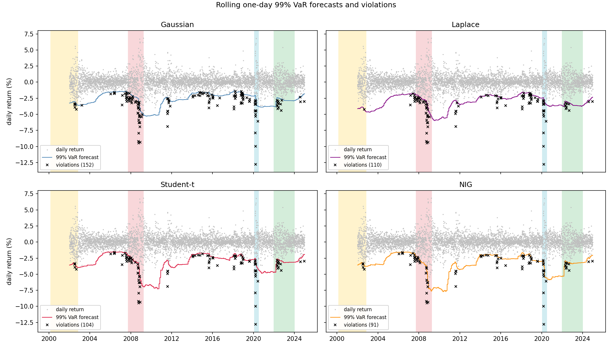
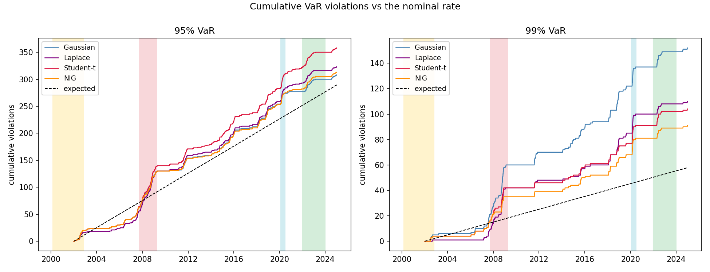
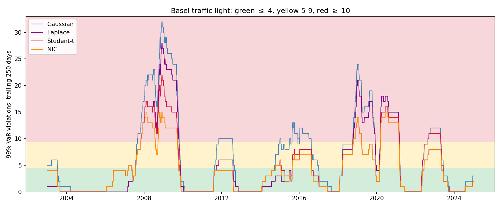

# Week 7 results: the rolling VaR backtest

## 1. Overview

Everything up to now has been in-sample: fit a distribution to the full history, read the risk numbers off the fitted tail. This week the models finally had to work for a living. Each one was refitted on a rolling 500-day window and asked, every day from January 2002 to December 2024, for tomorrow's Value-at-Risk. That gives 5,787 genuine out-of-sample forecasts per model per confidence level, and a hit sequence of days where the realised return fell below the forecast. Christoffersen's (1998) framework then asks the two questions that matter about that sequence: are there the right *number* of violations, and do they arrive *independently*? A model can only be called correct if the answer to both is yes.

This also puts the last of the four references to work. Christoffersen (1998) has been in the bibliography since Week 1 waiting for exactly this exercise.

The models are the four from the Bayesian arc: Gaussian, Laplace, Student-t and NIG, with the Laplace again standing in for the Variance-Gamma family as its symmetric special case. Windows were refitted every 21 trading days, roughly the monthly update cycle a risk desk would run, and the forecasts held fixed between refits.

The headline is a clean split. Rolling refits repair the *number* of violations at the 95% level for the Gaussian and the NIG, and the NIG comes closest at 99%. But every model, at every level, fails the independence test outright. The violations do not arrive as a trickle; they arrive as bursts in late 2008 and March 2020. A rolling window drags the whole distribution towards yesterday's volatility, but a month too late. The missing ingredient is not a heavier tail. It is conditional volatility, and no static marginal, however well chosen, can supply it.

---

## 2. Design

The window is 500 trading days, about two years: long enough for a stable four-parameter NIG fit, short enough to adapt across regimes. Models are refitted every 21 trading days and the parameters held in between. Each day's forecast is one-day-ahead VaR at 95%, 97.5% and 99%, read off the fitted distribution's quantile (closed form for the Gaussian, Laplace and Student-t; root-finding on the CDF for the NIG). A violation is a realised return strictly below the forecast.

One numerical note. On calm windows the rolling NIG regularly lands on its Gaussian-limit ridge (very large α with big standard errors), the same weakly identified regime the quarterly fits found in Week 6. scipy's generic NIG quantile fails to converge there, so the quantile is solved by hand: bracket using the NIG's own mean and standard deviation, then Brent's method on the CDF. On the ridge the quantile smoothly approaches the Gaussian one, which is the right behaviour.

Three likelihood-ratio tests per model and level, following Christoffersen (1998):

- **LR_uc** (Kupiec, unconditional coverage): is the violation rate equal to the nominal 5%, 2.5% or 1%? Chi-squared, 1 df.
- **LR_ind** (independence): is the chance of a violation today unaffected by whether yesterday was a violation, against a first-order Markov alternative? Chi-squared, 1 df.
- **LR_cc** (conditional coverage): the sum of the two, chi-squared with 2 df. This is the joint test the paper is about.

---

## 3. Coverage: how many violations

**Table 1. Rolling backtest, 5,787 out-of-sample days (Jan 2002 to Dec 2024). Expected violations are n x (1 - level).**

| Model | Level | Expected | Hits | Rate | LR_uc | p_uc | LR_ind | p_ind | LR_cc | p_cc |
|-------|-------|----------|------|------|-------|------|--------|-------|-------|------|
| Gaussian | 95% | 289 | 308 | 5.32% | 1.24 | 0.265 | 47.2 | <0.0001 | 48.5 | <0.0001 |
| Gaussian | 97.5% | 145 | 223 | 3.85% | 37.4 | <0.0001 | 39.7 | <0.0001 | 77.1 | <0.0001 |
| Gaussian | 99% | 58 | 152 | 2.63% | 106.9 | <0.0001 | 36.1 | <0.0001 | 142.9 | <0.0001 |
| Laplace | 95% | 289 | 323 | 5.58% | 3.98 | 0.046 | 35.7 | <0.0001 | 39.6 | <0.0001 |
| Laplace | 97.5% | 145 | 193 | 3.34% | 15.0 | 0.0001 | 34.6 | <0.0001 | 49.6 | <0.0001 |
| Laplace | 99% | 58 | 110 | 1.90% | 37.5 | <0.0001 | 28.0 | <0.0001 | 65.5 | <0.0001 |
| Student-t | 95% | 289 | 358 | 6.19% | 16.0 | 0.0001 | 39.0 | <0.0001 | 55.0 | <0.0001 |
| Student-t | 97.5% | 145 | 218 | 3.77% | 33.1 | <0.0001 | 35.9 | <0.0001 | 69.0 | <0.0001 |
| Student-t | 99% | 58 | 104 | 1.80% | 30.0 | <0.0001 | 18.6 | <0.0001 | 48.7 | <0.0001 |
| NIG | 95% | 289 | 313 | 5.41% | 1.98 | 0.159 | 37.5 | <0.0001 | 39.5 | <0.0001 |
| NIG | 97.5% | 145 | 177 | 3.06% | 6.92 | 0.009 | 31.9 | <0.0001 | 38.8 | <0.0001 |
| NIG | 99% | 58 | 91 | 1.57% | 16.3 | 0.0001 | 19.3 | <0.0001 | 35.6 | <0.0001 |

Three things stand out.

At 95% the Gaussian is fine and the Student-t is the worst model in the table. That inversion is worth dwelling on. The full-sample Student-t carries ν = 2.648, a tail heavy enough to flirt with infinite kurtosis. A distribution with that much mass far out in the tail has to take it from somewhere, and it takes it from the shoulders: its 5% quantile sits *closer to zero* than the Gaussian's for the same data. So at the everyday 95% level the t under-covers (358 hits against 289 expected, rejected at p = 0.0001) while the thin-tailed Gaussian, which spends its probability exactly where the 5% quantile lives, passes comfortably (p = 0.27). Heavy tails are a statement about extremes, and they carry a cost at moderate quantiles.

At 99% the ordering flips and the Gaussian collapses. It produces 152 violations where 58 were expected, a factor of 2.6, with LR_uc = 106.9. This is the out-of-sample counterpart of the 79.5% ES gap from Week 2: the Gaussian tail is simply too short where it matters. The NIG does best (91 hits, a factor of 1.57), then Student-t (104) and Laplace (110). Note that even the NIG is rejected on pure coverage at 99%; a static tail fitted to the last two years is still too short when the regime breaks.

And every cell of the LR_ind column is a rejection. More on that next.



*Figure 1. Rolling one-day 99% VaR forecasts (coloured line) against realised returns (grey), with violations marked. The crosses bunch in the GFC and COVID windows for every model.*

---

## 4. Independence: when the violations arrive

The independence statistics are large everywhere: LR_ind between 18.6 and 47.2, all with p-values that are zero to four decimal places. The mechanism is visible in the raw transition counts. At the 95% level, a day after a Gaussian violation had a 48-in-308 chance of being another violation, a repeat rate of about 16% against an unconditional 5.3%. The models are not wrong at random times; they are wrong in runs.

Figure 2 shows the same fact cumulatively. Violations accrue as staircases: flat for years, then a vertical jump in late 2008 and again in March 2020. The dashed line is what a correct model's staircase should look like.



*Figure 2. Cumulative violations at 95% (left) and 99% (right) against the nominal accrual (dashed). The GFC and COVID verticals are the independence failure made visible.*

This is the out-of-sample confirmation of the Week 5 posterior predictive result. There, all four models failed the one dependence statistic in the battery (the lag-1 autocorrelation of squared returns, observed 0.32 against replicate bands centred on zero) while the NIG passed every marginal check. Here the same split reappears with real forecasts: the NIG gets the closest to the right number of violations, and still fails their timing, because a 500-day window updated monthly cannot chase volatility that doubles inside a week. Cont's (2001) volatility clustering is exactly the stylised fact these iid models were built without, and the backtest sends the bill.

---

## 5. The Basel traffic light

Basel's backtesting regime keys the capital multiplier off the count of 99% violations in the trailing 250 days: green up to 4, yellow from 5 to 9, red at 10 or more, where the internal model is presumed broken.

**Table 2. Share of out-of-sample days each model spends in each Basel zone (99% VaR, trailing 250 days).**

| Model | Green | Yellow | Red | Worst 250-day count |
|-------|-------|--------|-----|---------------------|
| Gaussian | 53.2% | 16.0% | 30.8% | 32 |
| Laplace | 63.8% | 17.5% | 18.7% | 28 |
| Student-t | 65.3% | 16.7% | 17.9% | 22 |
| NIG | 66.6% | 19.3% | 14.1% | 15 |

A Gaussian desk spends almost a third of the 23 years in the red zone, and its worst 250-day window contains 32 violations, more than three times the red threshold and a level at which a regulator would simply withdraw model approval. The Lévy tails halve the red-zone time, and the NIG's worst window (15) is half the Gaussian's. But no model stays out of the red: every one of them breaches the threshold through the GFC and again around COVID, which is the traffic-light version of the independence failure.



*Figure 3. Trailing 250-day count of 99% violations per model over the Basel green, yellow and red bands.*

---

## 6. Expected Shortfall at 97.5%: what the models promised

FRTB (BCBS, 2013) replaces 99% VaR with 97.5% ES as the capital metric, so the last check compares, on the days each model's 97.5% VaR was breached, the average realised loss with the average ES the model had forecast for those same days. A ratio above 1 means the tail bit harder than promised.

**Table 3. Realised versus forecast losses on 97.5% breach days.**

| Model | Breach days | Mean realised | Mean forecast ES | Ratio |
|-------|-------------|---------------|------------------|-------|
| Gaussian | 223 | −2.99% | −2.25% | 1.33 |
| Laplace | 193 | −3.16% | −2.63% | 1.20 |
| Student-t | 218 | −3.02% | −3.12% | 0.97 |
| NIG | 177 | −3.18% | −2.96% | 1.07 |

The Gaussian falls short twice over: too many breach days (223 against 145 expected) *and* losses 33% deeper than the ES it booked on those days. Under FRTB that is precisely the number a capital charge is built on. The Student-t's promised shortfall is actually adequate (ratio 0.97), the same phenomenon as its 95% failure viewed from the other end: the heavy ν buys deep-tail honesty at the price of shoulder coverage. The NIG is 7% short, much the best balance of breach count and depth, which matches its Week 5 status as the only model to pass the marginal FRTB check.

---

## 7. Where this leaves the project

The backtest completes an argument that has been building since Week 2:

1. The full-sample tail is heavy (ν = 2.648) and the Gaussian understates 99% ES by 79.5% in-sample (Week 2). Out of sample, that shows up as 2.6 times too many 99% violations and realised breach losses 33% beyond the booked ES.
2. Choosing a better marginal genuinely helps. The NIG cuts the excess 99% violations from a factor 2.6 to 1.57, spends half as much time in the Basel red zone, and prices its own breaches to within 7%.
3. No marginal is enough. Every model fails Christoffersen's independence test at every level, because iid models, however heavy their tails, put the violations in the wrong places. The failure is not the size of the tail but its timing, and the timing is volatility clustering.

Point 3 is the honest limit of the project's model class, established formally in-sample in Week 5 and now out-of-sample here. It is also the natural closing argument for the write-up: the Lévy marginals fix what is fixable at the level of a static distribution, and what remains is, by construction, dynamics.

---

## Reproducing

```bash
pip install numpy pandas scipy matplotlib
python week7/code/week7_backtest.py                # defaults: window 500, refit 21
python week7/code/week7_backtest.py --window 250   # Basel-style one-year window
```

Outputs: `week7/data/week7_var_series.csv` (daily forecasts and hits), `week7_tests.csv`, `week7_basel_zones.csv`, `week7_es_check.csv`, and the three figures above.
