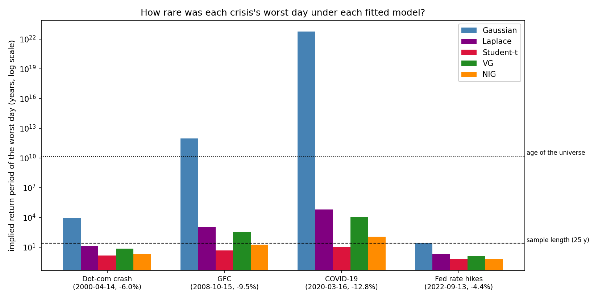
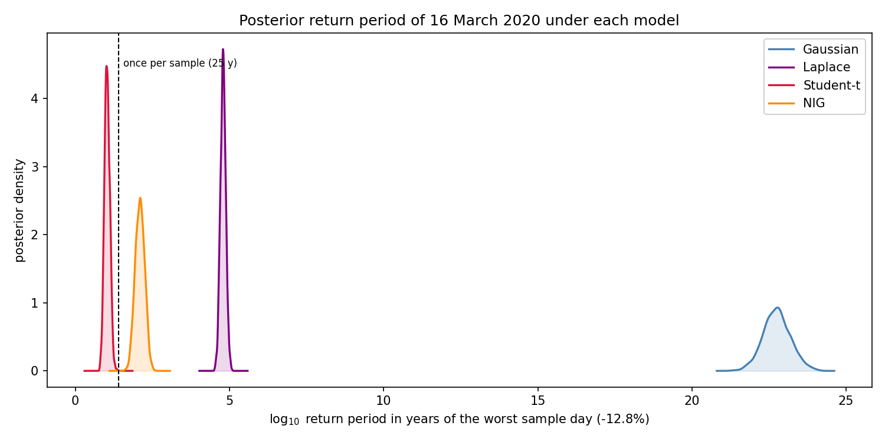
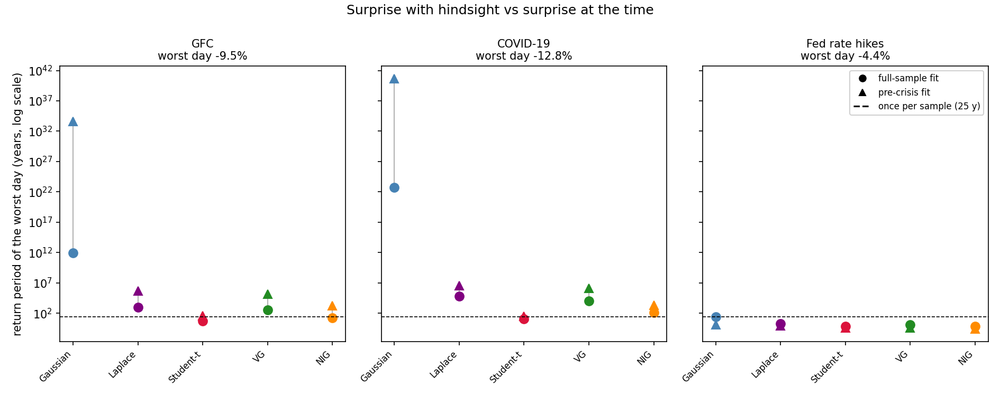
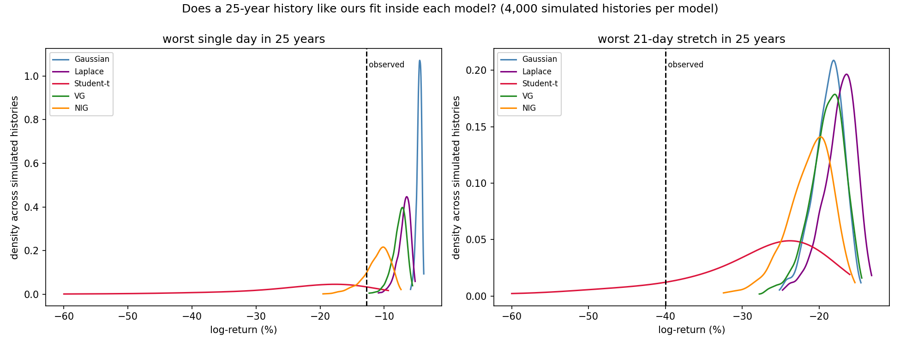
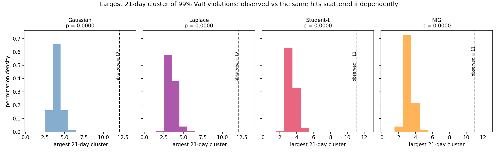

# Week 8 results: were the four crises Black Swans?

## 1. Overview

Taleb (2007) gives a Black Swan three attributes: it lies outside the realm of regular expectation, it carries an extreme impact, and human nature makes it explainable after the fact. The second and third attributes are history and psychology. The first one can be statisically measured. It measures an assumption that this whole project has been considering since Week 2. An event is only "outside regular expectation" relative to a model of what regular expectation is. A 12% down day is impossible under one distribution and merely a bad decade under another. So the question "were the dot-com crash, the GFC, COVID-19 and the 2022 Fed tightening Black Swans?" is not answerable in the abstract. It is answerable per mode

This week also puts a new name in the bibliography: Taleb (2007).

I measured this four ways. First with hindsight: the probability of each crisis's worst day under the five full-sample fits (Gaussian, Laplace, Student-t, VG, NIG). 

The Black Swan is an artifact of the Gaussian: the worst COVID-19 day is a once-per-10^22.7-years event under the Gaussian posterior (about four trillion ages of the universe), a once-per-125-years event under the NIG, and a once-per-decade event under the Student-t with its full-sample tail index ν = 2.648. On timing, the swan is real for every model in the class: no iid marginal, however heavy its tail, can place eleven or twelve 99% VaR violations inside one 21-day window, and all four models watched exactly that happen in late February 2020.

---

## 2. Making "outside regular expectation" measurable

I operationalised Taleb's first attribute as an exceedance probability. If a model with fitted parameters assigns probability p to a daily log-return at or below the observed worst day, then under that model such days recur on average every 1/p trading days, or

RP = 1 / (252 p) years.

A return period of two years is a routine event; a return period of a thousand years is an event the model considers effectively outside its world; a return period beyond the age of the universe means the model declares the event impossible in any sense that matters. The 25-year dashed line (the length of the sample) is the natural reference: an event whose model-implied return period is far beyond 25 years should probably not be sitting in a 25-year sample.

Two versions of p matter, and the gap between them is Taleb's point about hindsight. The full-sample fit has already seen the crisis it is judging, so it gives the model every possible advantage. The pre-crisis fit uses only the two years of data available the day before the crisis window opened, which is what "regular expectation" actually meant at the time. Section 5 measures both.

I computed the probabilities from the closed-form CDFs where they exist (Gaussian, Laplace, Student-t) and by numerical integration of the fitted density over the lower tail for the VG and NIG, reusing the log-domain Bessel implementations I validated in Week 3.

---

## 3. What the four crises actually did

**Table 1. The four shock windows (the same windows used since Week 2), with their worst single day, worst 5-day and worst 21-day cumulative log-returns.**

| Crisis | Window | Days | Worst day | Worst 1d | Worst 5d | Worst 21d | Window total |
|--------|--------|------|-----------|----------|----------|-----------|--------------|
| Dot-com crash | Mar 2000 to Oct 2002 | 671 | 2000-04-14 | -6.00% | -12.33% | -21.51% | -43.35% |
| GFC | Oct 2007 to Mar 2009 | 378 | 2008-10-15 | -9.47% | -20.26% | -35.71% | -64.90% |
| COVID-19 | Feb 2020 to Jun 2020 | 104 | 2020-03-16 | -12.77% | -19.80% | -40.00% | -3.96% |
| Fed rate hikes | Jan 2022 to Dec 2023 | 501 | 2022-09-13 | -4.42% | -10.78% | -13.88% | +0.08% |

The four events are structurally different, which matters for everything below. The dot-com crash and the Fed tightening are grinds: two years of losses with no single day worse than -6%. The GFC and COVID-19 are jump events, and COVID-19 is the extreme case: the worst day, the worst month (-40% in 21 days) and a window that nonetheless closes almost flat because the recovery was as violent as the fall.

---

## 4. Surprise with hindsight: return periods under the full-sample fits

**Table 2. Implied return period in years of each crisis's worst day under each full-sample MLE. The final column is the empirical recurrence: how often days at least that bad actually occurred in the 6,287-day sample.**

| Crisis (worst day) | Gaussian | Laplace | Student-t | VG | NIG | Empirical |
|--------------------|----------|---------|-----------|-----|-----|-----------|
| Dot-com, -6.00% | 9,470 | 14.5 | 1.5 | 7.3 | 2.0 | 13 days, one per 1.9 y |
| GFC, -9.47% | 9.3 x 10^11 | 1,050 | 4.9 | 318 | 17.5 | 3 days, one per 8.3 y |
| COVID-19, -12.77% | 5.6 x 10^22 | 62,400 | 10.6 | 11,400 | 119 | 1 day, one per 24.9 y |
| Fed hikes, -4.42% | 28.1 | 2.0 | 0.7 | 1.3 | 0.7 | 33 days, one per 0.8 y |



*Figure 1. Implied return period (log scale) of each crisis's worst single day under the five full-sample fits. The dashed line is the sample length; the dotted line is the age of the universe. The Gaussian's GFC and COVID-19 bars clear the age of the universe by factors of 67 and four trillion.*

The empirical column is the referee here, and for my money this is the best single table the project has produced.

The Gaussian declares every jump event impossible. The GFC's worst day is a 67-ages-of-the-universe event; COVID-19's is four trillion ages. Even the mild -4.42% of September 2022, a day the sample serves up 33 times, gets a return period (28 years) longer than the sample that contains it. Under the Gaussian, all four crises are textbook Black Swans, and that is a statement about the Gaussian.

The Student-t (ν = 2.648) absolves everything. Its implied recurrence matches the empirical column almost exactly at the two grind events (1.5 vs 1.9 years for dot-com, 0.7 vs 0.8 years for the Fed hikes) and stays on the right side of plausibility for the jumps: the GFC day once per 4.9 years, the COVID-19 day once per decade. A once-per-decade event inside a 25-year sample is not a swan of any colour.

The NIG grades the same events one notch rarer: 17.5 years for the GFC day, 119 for COVID-19. These are grey swans in Taleb's own taxonomy: rare, consequential, but squarely inside the model's world.

The rows that taught me the most are the Laplace and VG. By likelihood they are excellent (the Week 3 result: the Laplace captures 96% of the NIG's AIC gain over the Gaussian), yet they price the COVID-19 day at once per 62,400 and 11,400 years respectively, three to four orders too rare. The likelihood is dominated by the centre of the distribution, where these exponential-tailed models excel; the Black Swan question is decided ten standard deviations out, where they revert to Gaussian-style dismissal. Fitting the data well and respecting its extremes turn out to be different skills, and only the power-law tail of the t (and, at one remove, the semi-heavy NIG tail) has the second one.

### The Bayesian version

Point estimates might hide the verdict behind parameter uncertainty, so I pushed the Week 4 posterior draws through the same calculation for the worst day in the sample, 16 March 2020.

**Table 3. Posterior distribution of log10(return period in years) of the 16 March 2020 return, 2,000 draws per model.**

| Model | Posterior median | 94% interval |
|-------|------------------|--------------|
| Gaussian | 22.75 | [21.90, 23.61] |
| Laplace | 4.79 | [4.64, 4.96] |
| Student-t | 1.03 | [0.88, 1.20] |
| NIG | 2.10 | [1.81, 2.37] |



*Figure 2. Posterior densities of the log10 return period. Within-model uncertainty spans a few tenths of a decade; between-model disagreement spans 21 decades.*

The parameter uncertainty is a rounding error next to the model gap. The Gaussian's entire 94% interval sits between 10^21.9 and 10^23.6 years; the Student-t's sits between 8 and 16 years. Whether 16 March 2020 was a Black Swan is not something the data leave uncertain given a model. It is decided, wholesale, by the choice of tail.

---

## 5. Surprise at the time: pre-crisis fits

Hindsight fits flatter every model, because the crisis days are in the estimation sample pulling the tails outward. The honest question is Taleb's actual one: how far outside regular expectation was the event, where "regular expectation" is a model fitted on the two years before it happened? I refitted all five models on the 500 trading days ending the day before each window opens. I had to leave the dot-com window out: the sample starts in January 2000, which leaves only 39 pre-crisis days (the same problem Week 3 hit with the dot-com lead-up, and I am keeping to the decision not to carry pre-2000 data into the analysis).

**Table 4. Crisis days scored under the frozen pre-crisis fit: return period of the worst day, mean log predictive density per crisis day, and the number of crisis days the model priced below one-in-a-thousand.**

| Crisis | Model | RP of worst day (years) | Mean log-score | Days with p < 0.001 |
|--------|-------|------------------------|----------------|---------------------|
| GFC (378 days) | Gaussian | 4.2 x 10^33 | -1.18 | 53 |
| | Laplace | 443,000 | 1.44 | 29 |
| | Student-t | 39.2 | 1.72 | 17 |
| | VG | 146,000 | 1.45 | 26 |
| | NIG | 1,820 | 1.62 | 20 |
| COVID-19 (104 days) | Gaussian | 4.5 x 10^40 | -2.13 | 17 |
| | Laplace | 3.5 x 10^6 | 0.99 | 9 |
| | Student-t | 34.4 | 1.41 | 4 |
| | VG | 1.3 x 10^6 | 0.98 | 9 |
| | NIG | 2,100 | 1.22 | 5 |
| Fed hikes (501 days) | Gaussian | 1.19 | 2.91 | 0 |
| | Laplace | 0.84 | 2.98 | 0 |
| | Student-t | 0.36 | 2.95 | 0 |
| | VG | 0.41 | 2.95 | 0 |
| | NIG | 0.26 | 2.95 | 0 |



*Figure 3. Return period of each crisis's worst day under the full-sample fit (circles) against the pre-crisis fit (triangles). The Gaussian's hindsight-to-foresight gap spans 20 or more additional orders of magnitude; the Student-t's barely moves.*

Four things stood out to me.

The Gaussian's surprise explodes out of sample. Trained on the calm of 2005 to 2007, it prices the 15 October 2008 return at once per 10^33 years; trained on 2018 to 2019, it prices 16 March 2020 at once per 10^40. Its mean log-score on crisis days is negative in both episodes, which for daily returns (where a competent model earns a log density around +3) means it assigned essentially zero probability to what happened, day after day, for months. It also priced 53 of the GFC's 378 days below one-in-a-thousand: one trading day in seven was, by its own account, a once-in-four-years event.

The Student-t barely notices the difference between hindsight and foresight. Its pre-crisis return periods are 39 years for the GFC day and 34 for COVID-19, against 4.9 and 10.6 with hindsight. A power-law tail index estimated on two calm years is still a power law, so the model keeps its scepticism about calm even when the recent data contain none. At the moment it happened, the worst COVID-19 day was, under the t, a once-in-a-generation event: severe, but named and priced.

The NIG loses three orders of magnitude out of sample. Its pre-crisis return periods (1,820 and 2,100 years) are far worse than its hindsight ones (17.5 and 119). The mechanism is the Week 6 and Week 7 finding: on calm windows the NIG MLE drifts onto its Gaussian-limit ridge (α large, tails light), so a two-year calm window hands the crisis a much thinner tail than the full sample would. The t's tail survives calm training data; the NIG's does not. I had not expected this asymmetry, and for a risk desk that refits on rolling windows it matters as much as the full-sample likelihood ranking.

And the Fed tightening was no swan at all. Every model, including the Gaussian, priced the whole of 2022 and 2023 within about a year's return period, and no model priced a single day below one-in-a-thousand. A bear market delivered as five hundred ordinary down days is exactly what every one of these distributions expects.

The Week 3 lead-up regression completes the picture on Taleb's "no warning" criterion. The GFC brewed visibly: the z-score table showed elevated drawdown and volatility through 2007. COVID-19 erupted from below-average volatility and VIX, with no signal in any of the seven predictors. Combining the two dimensions: the GFC was rare but both priceable and visibly assembling itself (a grey swan); COVID-19 arrived unannounced and was the largest at-the-time surprise in the table, the closest thing in the sample to a genuine Black Swan, and even it sat within a once-in-a-generation tail under the right marginal.

---

## 6. Could 2000 to 2024 have come from these models at all?

Return periods interrogate one day at a time. A stricter test asks the models to reproduce the sample as a whole: I simulated 4,000 independent 25-year histories (6,287 days each) from each fitted model and recorded, per history, the worst day, the worst 21-day stretch, and the number of days below three and five empirical standard deviations. The observed history has a worst day of -12.77%, a worst 21-day stretch of -40.00%, 51 days below -3σ and 11 days below -5σ.

**Table 5. Share of simulated 25-year histories at least as extreme as the observed one, with the median simulated value in brackets.**

| Model | Worst day ≤ -12.77% | Worst 21d ≤ -40.0% | ≥ 51 days < -3σ | ≥ 11 days < -5σ |
|-------|---------------------|--------------------|-----------------|-----------------|
| Gaussian | 0.000 (-4.5%) | 0.000 (-18.6%) | 0.000 (8) | 0.000 (0) |
| Laplace | 0.000 (-6.7%) | 0.000 (-17.1%) | 0.000 (31) | 0.000 (1) |
| Student-t | 0.914 (-20.7%) | 0.167 (-26.5%) | 0.793 (56) | 0.918 (16) |
| VG | 0.004 (-7.5%) | 0.000 (-18.7%) | 0.180 (45) | 0.000 (3) |
| NIG | 0.193 (-10.7%) | 0.000 (-20.8%) | 0.985 (67) | 0.627 (12) |



*Figure 4. Distribution across 4,000 simulated histories of the worst single day (left) and the worst 21-day stretch (right), with the observed values dashed. Only the Student-t places real mass beyond both observed lines.*

Three of the five models simply cannot generate our history. In 4,000 attempts the Gaussian never produced a day worse than about -6% (median worst day -4.5%), the Laplace never reached -12.77%, and the VG got there 14 times in 4,000. None of the three ever produced 11 days below -5σ. The exponential-tail verdict from Section 4 is confirmed at the whole-sample level.

The Student-t passes the daily tests almost too well: 91% of its histories contain a day worse than our worst, and its median worst day is -20.7%, considerably beyond anything the S&P 500 has done in this sample. This is the overshoot Week 7 saw from the other side (the t buying deep-tail mass at the cost of shoulder coverage), now visible as a tendency to invent catastrophes larger than history's. The NIG is the best calibrated on daily extremes: the observed worst day sits at the 19th percentile of its distribution and the -5σ count at the 63rd, neither surprising nor overshot.

The column that defeats everyone is the worst 21-day stretch. History assembled -40% in a month; the best any iid model manages is the t's 16.7%, and the NIG, calibrated so well on single days, produces a month that bad three times in ten thousand histories. The reason is structural. An iid model must build a catastrophic month out of independently drawn bad days, and independence makes the pieces refuse to line up. History builds it the other way: one shock arrives and the days stop being independent. Which is the bridge to the last measurement.

---

## 7. The swan that survives: timing

Week 5 showed the iid models fail the squared-return autocorrelation check in-sample; Week 7 showed every model failing Christoffersen's independence test out of sample. This section makes the same point in Taleb's currency: probability. Take each model's Week 7 hit sequence at the 99% level and hold its total number of violations fixed, which forgives every error of magnitude in advance. Scatter those violations uniformly over the 5,787 backtest days, 20,000 times, and record the largest number falling in any 21-day window.

**Table 6. Largest 21-day cluster of 99% VaR violations: observed vs the same number of hits placed independently.**

| Model | Total hits | Observed max cluster | When | iid median | iid 99th pct | p-value |
|-------|-----------|----------------------|------|-----------|--------------|---------|
| Gaussian | 152 | 12 | late Feb 2020 | 4 | 6 | < 1/20,000 |
| Laplace | 110 | 12 | late Feb 2020 | 3 | 5 | < 1/20,000 |
| Student-t | 104 | 11 | late Feb 2020 | 3 | 5 | < 1/20,000 |
| NIG | 91 | 11 | late Feb 2020 | 3 | 5 | < 1/20,000 |



*Figure 5. Permutation distribution of the largest 21-day violation cluster per model, observed value dashed. No permutation in 20,000 reached the observed cluster for any model.*

Every model, including the two whose tails Section 4 vindicated, watched eleven or twelve of its 99% violations land inside a single month, when independence would put the record for the entire 23-year backtest at five or six. Not one permutation in twenty thousand got there. And it is the same month for all four models: the COVID-19 crash of late February and March 2020.

This is the cleanest statement of the project's central limit (in both senses). Upgrading the marginal from Gaussian to Student-t or NIG moves the magnitude of crisis days from "impossible" to "expected": that swan was an artifact of the model. Nothing in the iid class moves their arrangement in time. Conditional on their own hit counts, all four models found the timing of March 2020 a sub-1-in-20,000 event. The magnitude swan is curable by a better distribution; the timing swan is the volatility clustering of Cont (2001), and within this model class it is incurable by construction.

---

## 8. Verdict

Sorting the four crises with both dimensions in hand:

| Crisis | Under the Gaussian | Under the Student-t / NIG | Warning (Week 3) | Verdict |
|--------|--------------------|--------------------------|------------------|---------|
| Dot-com crash | Black (worst day once per 9,470 y) | Routine (1.5 to 2 y) | outside sample | Not a swan: a grind of ordinary days |
| GFC | Black (67 ages of the universe) | Rare but priced (5 to 40 y at the time) | visible build-up | Grey swan |
| COVID-19 | Black (10^22 y; 10^40 at the time) | Once-in-a-generation at the time | none | Closest to a true Black Swan; magnitude priceable, timing not |
| Fed rate hikes | Marginal (28 y) | Routine (< 1 y) | n/a | White swan under every model |

Three conclusions carry forward to the final report.

First, the Black Swan is model-relative, and mostly a Gaussian artifact. The same day is four trillion ages of the universe away under the Gaussian and a bad decade under the Student-t. Taleb's accusation, that finance manufactures its own swans by assuming thin tails, is exactly what Table 2 shows, and the Bayesian version confirms the verdict is a model choice, not estimation noise: 21 decades of disagreement between models against a few tenths of a decade of uncertainty within them.

Second, not all heavy tails are equal when it matters. The exponential-tailed Laplace and VG, excellent by likelihood, misprice the extremes by three to four orders of magnitude; the practical content of Week 2's twin anchors (ν = 2.648, and the 79.5% Gaussian understatement of 99% ES) lives specifically in the power-law region. Robustness differs too: refitted on calm pre-crisis windows, the t kept its tail while the NIG slid toward its Gaussian limit and gave up three orders of magnitude of foresight. Under an FRTB-style regime (BCBS, 2013) where models are re-estimated on recent windows, that fragility is a capital-relevant property, not a curiosity.

Third, what remains of Taleb's swan, after the best marginal has done its work, is timing. Every model in the class, granted its own violation count, finds the clustering of March 2020 essentially impossible. The residual unpredictability is not in how bad the days were but in their refusal to arrive independently, and no static distribution, however heavy-tailed, addresses that. This is the sharpest form yet of the argument the final report will close on: the honest boundary of iid Lévy modelling is volatility clustering, and crossing it requires dynamics.

---

## Reference added this week

Taleb, N. N. (2007). *The Black Swan: The Impact of the Highly Improbable*. New York: Random House.

This joins the four locked references (BCBS 2013; Christoffersen 1998; Cont 2001; Madan, Carr and Chang 1998) as the fifth and final entry in the project bibliography.

---

## Reproducing

```bash
pip install numpy pandas scipy matplotlib
python week8/code/week8_black_swan.py                    # all four measurements
python week8/code/week8_black_swan.py --mode surprise    # or oos / extremes / clustering
python week8/code/week8_black_swan.py --paths 2000       # faster simulation run
```

Modes 1 and 3 need only `week4/data/sp500_returns.csv` (the cached return series); mode 1's Bayesian part reads the Week 4 posterior CSVs; mode 4 reads the Week 7 hit sequences from `week7/data/week7_var_series.csv` (rerun `week7/code/week7_backtest.py` first if absent). Outputs: `week8_crisis_stats.csv`, `week8_surprise_table.csv`, `week8_posterior_rp.csv`, `week8_oos_table.csv`, `week8_extremes_table.csv`, `week8_clustering.csv` in `week8/data/`, and the five figures above in `week8/figures/`.
